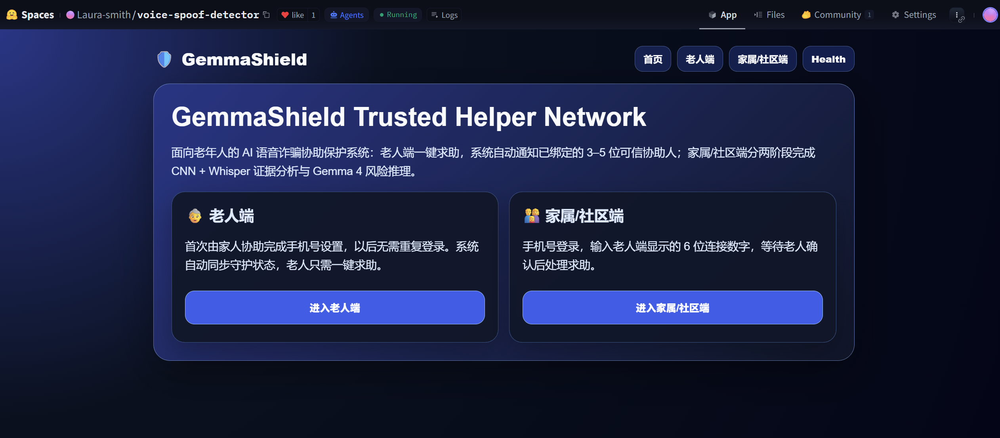
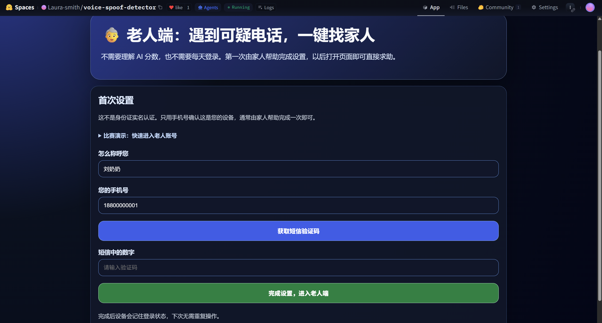
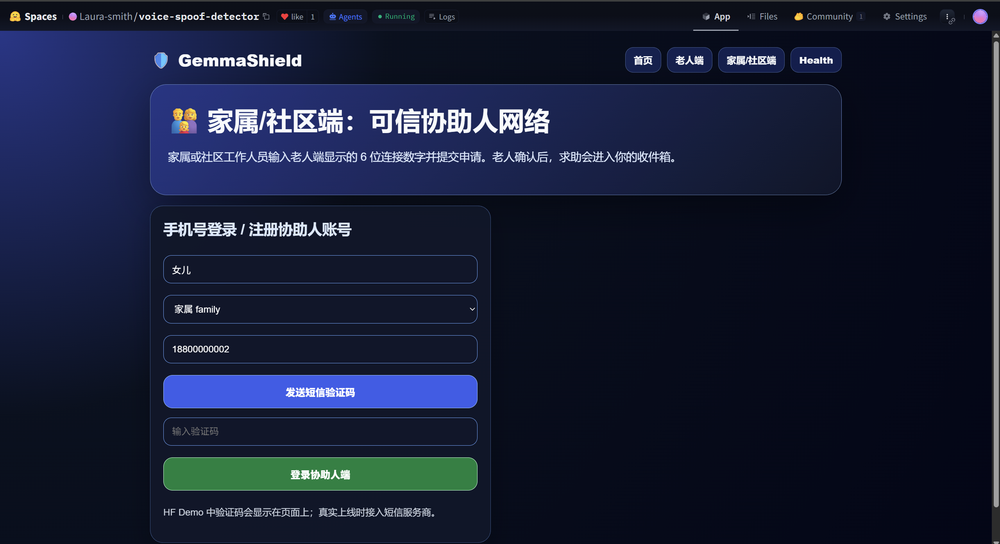
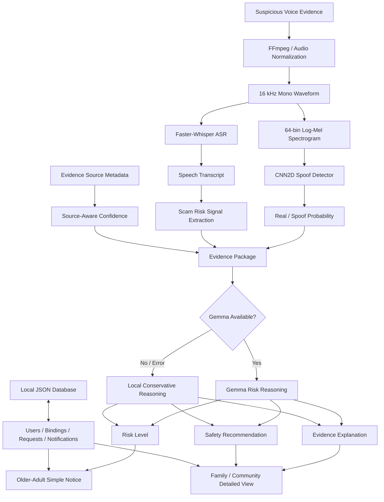
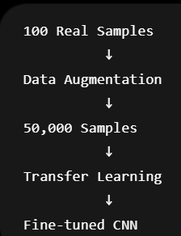
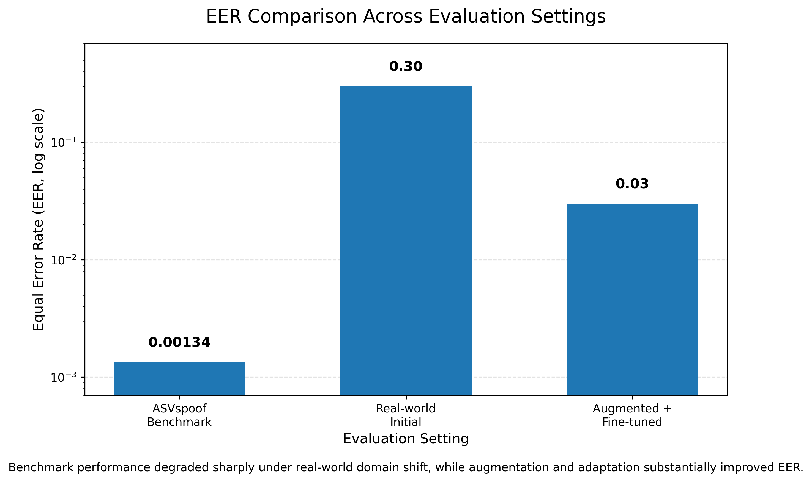
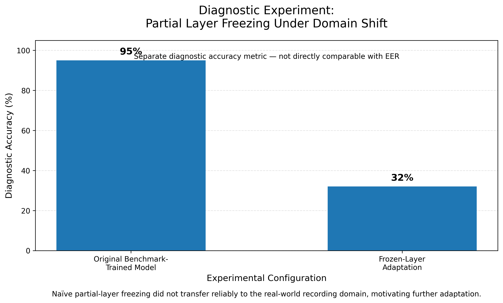

# 🛡️ AI Voice Safety Agent

<p align="right">
  <strong>English</strong> · <a href="./README.zh-CN.md">简体中文</a>
</p>

<p align="center">
  <strong>A multimodal AI safety system for voice spoof detection, scam-risk reasoning, and trusted human assistance.</strong>
</p>

<p align="center">
  Voice Spoof Detection × Speech Transcription × LLM Risk Reasoning × Human-Centered AI
</p>

<p align="center">
  <a href="https://huggingface.co/spaces/Laura-smith/voice-spoof-detector">🌐 Live Demo</a>
  ·
  <a href="#6-demo">🎥 Demo</a>
  ·
  <a href="#10-research-findings">🔬 Research Findings</a>
  ·
  <a href="#14-quick-start">⚙️ Quick Start</a>
</p>

<p align="center">
  
  
  
  
  
  
</p>

> [!IMPORTANT]
> AI Voice Safety Agent is a research and engineering prototype.
> It provides supporting evidence and safety recommendations, but it must not be treated as a final legal, financial, identity-verification, or law-enforcement decision system.

---

## Table of Contents

- [1. Project Overview](#1-project-overview)
- [2. Why This Project Matters](#2-why-this-project-matters)
- [3. From a Voice Classifier to a Safety System](#3-from-a-voice-classifier-to-a-safety-system)
- [4. Core Features](#4-core-features)
- [5. User Roles and Workflow](#5-user-roles-and-workflow)
- [6. Demo](#6-demo)
- [7. System Architecture](#7-system-architecture)
- [8. AI Analysis Pipeline](#8-ai-analysis-pipeline)
- [9. CNN Spoof Detection Model](#9-cnn-spoof-detection-model)
- [10. Research Findings](#10-research-findings)
- [11. Current Deployment Strategy](#11-current-deployment-strategy)
- [12. Technology Stack](#12-technology-stack)
- [13. Repository Structure](#13-repository-structure)
- [14. Quick Start](#14-quick-start)
- [15. Training](#15-training)
- [16. Configuration](#16-configuration)
- [17. Data, Privacy and Responsible Use](#17-data-privacy-and-responsible-use)
- [18. Current Limitations](#18-current-limitations)
- [19. Future Work](#19-future-work)
- [20. What This Project Demonstrates](#20-what-this-project-demonstrates)
- [21. Author and License](#21-author-and-license)

---

## 1. Project Overview

**AI Voice Safety Agent** is the open-source engineering repository for the product prototype **GemmaShield**.

GemmaShield is a multimodal AI safety system designed to help older adults, family members, and community workers respond to suspicious voice messages and potential AI voice scams.

The system integrates:

- CNN-based voice spoof detection;
- Faster-Whisper speech transcription;
- scam-related signal extraction;
- evidence-source confidence analysis;
- Gemma-based risk reasoning;
- conservative local fallback reasoning;
- an older-adult interface;
- a family/community helper interface;
- trusted-contact binding and assistance workflows.

The project originally started as a binary classifier for distinguishing AI-generated speech from genuine human speech.

However, real-world experiments revealed an important problem:

> Strong performance on a laboratory benchmark did not automatically transfer to mobile recordings and realistic spoofing conditions.

This finding changed the direction of the project.

Instead of treating the CNN prediction as a final answer, the current system treats the model score as **one piece of acoustic evidence** and combines it with:

```text
Acoustic Evidence
+
Speech Transcript
+
Scam Risk Signals
+
Evidence Source Reliability
+
LLM Reasoning
+
Human Verification
```

The project therefore explores two connected directions:

### AI Research

```text
Deepfake Speech Detection
Domain Shift
Generalization
Robustness
Unseen Attack Detection
```

### AI Application Engineering

```text
Backend Development
Workflow Design
LLM Integration
Fallback Logic
Human-in-the-Loop Safety
Deployment
```

---

## 2. Why This Project Matters

Traditional voice spoof detection systems often return only a numerical prediction:

```text
Fake Probability: 0.82
```

For a non-technical user, especially an older adult, this number does not answer the most important questions:

- Why is the voice suspicious?
- Is the caller asking for money?
- Is the caller pretending to be a family member?
- Is the caller creating urgency?
- Is the audio evidence itself reliable?
- Should the user continue the conversation?
- Should a trusted family member be contacted?
- What should happen if the model is uncertain?

AI Voice Safety Agent attempts to bridge this gap.

The system transforms raw AI outputs into:

```text
Risk Level
+
Evidence Explanation
+
Safety Recommendation
+
Trusted Human Assistance
```

The design follows one central principle:

> A safety-oriented AI system should not only make a prediction. It should communicate uncertainty, explain available evidence, and allow trusted humans to intervene.

---

## 3. From a Voice Classifier to a Safety System

### Initial Version

The first version of the project focused on:

```text
Audio
  ↓
Log-Mel Spectrogram
  ↓
CNN
  ↓
Real / Fake
```

This was useful for model experimentation, but real-world evaluation revealed limitations.

### Current Version

The current system implements a broader workflow:

```text
Suspicious Audio
        ↓
Audio Preprocessing
        ↓
 ┌───────────────┬────────────────┐
 ↓               ↓
CNN              Faster-Whisper
 ↓               ↓
Acoustic         Transcript
Evidence          ↓
        └──────┬──┘
               ↓
      Scam Risk Signals
               +
     Evidence Source Info
               ↓
      Gemma Risk Reasoning
               ↓
 Risk Level + Explanation
               ↓
Older Adult + Trusted Helper
```

The main engineering lesson is:

> When a model is imperfect under domain shift, uncertainty communication, evidence management, access control, fallback logic, and human escalation become part of the safety solution.

---

## 4. Core Features

### AI and Audio Analysis

- 16 kHz mono audio normalization;
- fixed-length waveform processing;
- 64-bin Log-Mel spectrogram extraction;
- custom CNN2D spoof detector;
- real/spoof probability estimation;
- Faster-Whisper speech recognition;
- scam-related risk-signal extraction;
- evidence-source confidence analysis;
- Gemma-based structured risk reasoning;
- conservative local fallback reasoning.

### Risk Levels

The prototype uses four safety levels:

```text
HIGH
MEDIUM
VERIFY
LOW
```

| Level | Meaning |
|---|---|
| `HIGH` | Strong spoof evidence or serious scam signals |
| `MEDIUM` | Suspicious or uncertain evidence |
| `VERIFY` | Evidence is not reliable enough to reach a safe conclusion |
| `LOW` | No obvious high-risk signal under the available evidence |

`LOW` does **not** mean that the system has proven the audio to be safe.

### Product Workflow

The application currently supports:

- older-adult accounts;
- family/community helper accounts;
- demo phone verification;
- six-digit trusted-helper binding codes;
- helper binding requests;
- older-adult approval;
- up to five trusted helpers;
- one-click assistance requests;
- helper-side request inbox;
- permission control;
- audio recording;
- audio upload;
- evidence review;
- unbinding and trusted-contact replacement;
- simulated SMS / WeChat / app-push notifications;
- local prototype persistence;
- health monitoring;
- Hugging Face deployment.

### Human-Centered Design

The older-adult interface emphasizes:

- large readable text;
- high contrast;
- simple actions;
- minimal technical information;
- clear risk categories;
- actionable safety suggestions.

The helper interface provides more detailed evidence and analysis.

---

## 5. User Roles and Workflow

### 5.1 Older-Adult Side

The older adult can:

1. complete first-time setup;
2. obtain a six-digit binding code;
3. approve family or community helpers;
4. record or upload suspicious audio;
5. send an assistance request;
6. receive a simple safety notice;
7. review previous assistance requests;
8. replace or remove trusted helpers.

The older-adult interface intentionally avoids requiring the user to interpret raw AI probability scores.

### 5.2 Family / Community Helper Side

A trusted helper can:

1. create or access a helper account;
2. enter the older adult's six-digit binding code;
3. send a binding request;
4. wait for approval;
5. receive assistance requests;
6. inspect the evidence source;
7. review available audio;
8. upload additional evidence;
9. run CNN + Whisper analysis;
10. request Gemma risk reasoning;
11. review the detailed report;
12. help the older adult verify the situation.

### 5.3 Two-Stage Analysis

#### Stage 1 — Evidence Extraction

```text
CNN Spoof Detection
+
Faster-Whisper
+
Risk Signal Extraction
+
Evidence Source Confidence
```

#### Stage 2 — Risk Reasoning

```text
Gemma Risk Reasoning
```

If Gemma is unavailable:

```text
Local Conservative Reasoning
```

is used instead.

---

## System Screenshots

### Home Page

<p align="center">
  
</p>

### Older-Adult Interface

<p align="center">
  
</p>

### Family / Community Helper Interface

<p align="center">
  
</p>

---

## 6. Demo

### Live Application

🌐 [Open GemmaShield on Hugging Face Spaces](https://huggingface.co/spaces/Laura-smith/voice-spoof-detector)

### Full Workflow Video

🎥 [Watch the complete workflow demonstration](assets/demo-video.mp4)

The application contains multiple states that cannot be demonstrated clearly through one static screenshot.

The complete workflow includes:

```text
Older-Adult Setup
      ↓
Helper Registration
      ↓
Binding Request
      ↓
Older-Adult Approval
      ↓
One-Click Help Request
      ↓
Audio Evidence
      ↓
CNN + Whisper
      ↓
Helper Evidence Review
      ↓
Gemma Reasoning
      ↓
Safety Recommendation
```

> If the Hugging Face Space is temporarily unavailable because of regional or network restrictions, please use the recorded demonstration or run the project locally.

---

## 7. System Architecture



### Application Layers

| Layer | Responsibility |
|---|---|
| Input Layer | Recorded or uploaded suspicious voice evidence |
| Acoustic Layer | CNN-based real/spoof estimation |
| Semantic Layer | Whisper transcription and scam-signal analysis |
| Confidence Layer | Evidence-source reliability |
| Reasoning Layer | Gemma or fallback risk reasoning |
| Workflow Layer | User roles, binding, requests and permissions |
| Interaction Layer | Older-adult and helper interfaces |

---

## 8. AI Analysis Pipeline

### 8.1 Audio Normalization

Audio is converted to:

```text
Sample Rate: 16,000 Hz
Channels: Mono
Target Length: 64,000 samples
Approximate Analysis Window: 4 seconds
```

The waveform is normalized before feature extraction.

FFmpeg is used when format conversion is required.

### 8.2 Log-Mel Spectrogram

The model uses:

```text
n_fft = 1024
hop_length = 512
n_mels = 64
```

Processing:

```text
Waveform
   ↓
Mel Spectrogram
   ↓
Log Transform
   ↓
Feature Normalization
```

### 8.3 CNN Acoustic Evidence

The CNN produces a binary logit.

The application converts it to:

```text
Real Probability = sigmoid(logit)

Spoof Probability = 1 - Real Probability
```

The result is treated as acoustic evidence rather than a final safety judgment.

### 8.4 Faster-Whisper Transcription

Faster-Whisper extracts speech content.

Semantic information can provide evidence that the CNN cannot capture.

Examples:

```text
"Send the money immediately."

"Don't tell anyone."

"I am your grandson."

"Give me the verification code."
```

may contain strong scam indicators even when acoustic evidence is uncertain.

### 8.5 Scam Risk Signals

The application checks for signals related to:

```text
Money Transfer
Verification Codes
Passwords
Urgency Pressure
Family Impersonation
Investment Promises
Bank Accounts
```

These signals provide structured information for later reasoning.

They are not used as a replacement for the language model.

### 8.6 Evidence Source Confidence

One important deployment finding is that the audio source affects acoustic reliability.

| Evidence Source | Confidence Treatment | Main Concern |
|---|---|---|
| Browser / microphone recording | Needs human review | Replay, room acoustics, device noise |
| Older-adult uploaded audio | Medium | Unknown source processing |
| Social-media voice message | Medium | Compression |
| Voicemail | Medium | Codec and channel effects |
| Saved call recording | Relatively higher | Telephone-channel effects |
| Helper-uploaded evidence | Relatively higher | Depends on original source |

A microphone re-recording may modify acoustic artifacts.

Therefore:

```text
Low Spoof Probability
```

does not automatically become:

```text
Safe
```

### 8.7 Gemma Risk Reasoning

Gemma receives structured evidence including:

```text
Real Probability
Spoof Probability
Transcript
Preliminary Risk Level
Scam Type
Risk Signals
Evidence Source
Evidence Confidence
```

Gemma generates:

```text
Risk Level
Reason
Acoustic Evidence Explanation
Textual Evidence Explanation
Advice for the Older Adult
Advice for the Helper
One-Sentence Warning
```

Gemma is used as a reasoning and communication layer.

It does not replace the CNN and is not presented as a final authority.

### 8.8 Fallback Reasoning

Local conservative reasoning is activated when:

```text
HF_TOKEN is missing
Gemma client initialization fails
Gemma API call fails
Gemma response is invalid
```

This prevents the entire application from becoming unavailable because of one external AI service.

---

## 9. CNN Spoof Detection Model

The custom CNN is implemented in:

```text
model.py
```

### Architecture

```text
Input
 ↓
Conv2D
1 → 32
 ↓
BatchNorm
 ↓
ReLU
 ↓
MaxPool
 ↓
Conv2D
32 → 64
 ↓
BatchNorm
 ↓
ReLU
 ↓
MaxPool
 ↓
Conv2D
64 → 128
 ↓
ReLU
 ↓
Adaptive Average Pooling
 ↓
Flatten
 ↓
Linear
128 → 64
 ↓
ReLU
 ↓
Linear
64 → 1
```

### Input Representation

```text
Normalized 64-bin Log-Mel Spectrogram
```

Approximate tensor structure:

```text
[Batch, 1, 64, Time]
```

### Training

The model uses:

```text
BCEWithLogitsLoss
Adam Optimizer
```

The task is:

```text
Real Speech
vs.
Spoof Speech
```

The main research metric reported in this project is:

```text
Equal Error Rate (EER)
```

Lower EER indicates better performance.

---

## 10. Research Findings

### 10.1 Research Question

The central research question became:

> Does strong performance on a controlled anti-spoofing benchmark transfer to realistic mobile and deployment conditions?

---

### 10.2 ASVspoof Benchmark Evaluation

The CNN was initially trained and evaluated using ASVspoof research data.

Under the controlled benchmark setting:

```text
ASVspoof Benchmark EER
≈ 0.00134
```

This demonstrated strong performance when training and evaluation conditions were closely matched.

---

### 10.3 Real-World Evaluation

To evaluate deployment robustness, approximately:

```text
100 real-world audio samples
```

were additionally collected and tested.

The real-world evaluation included conditions such as:

- mobile recordings;
- replayed speech;
- AI-generated voices;
- microphone variation;
- environmental noise;
- compressed audio;
- transmitted audio.

Performance changed substantially:

```text
Initial Real-World EER
≈ 0.30
```

This revealed a major domain gap between benchmark evaluation and realistic deployment conditions.

---

### 10.4 Data Augmentation

Because the original real-world dataset was small, a custom augmentation pipeline was developed.

Approximately:

```text
100 original real-world samples
```

were expanded into approximately:

```text
50,000 augmented samples
```

using techniques including:

```text
Noise Injection
Pitch Shifting
Replay Simulation
Frequency Perturbation
Audio Distortion
Waveform Modification
```

<p align="center">
  
</p>

<p align="center">
  <em>Real-world data augmentation and adaptation workflow.</em>
</p>

---

### 10.5 Transfer Learning and Fine-Tuning

Instead of completely discarding the benchmark-trained CNN, the project explored transfer learning.

The general strategy was:

```text
ASVspoof-Pretrained CNN
       ↓
Retain Learned Representation
       ↓
Adapt Selected Layers
       ↓
Train with Augmented Real-World Data
       ↓
Fine-Tuned CNN
```

After augmentation and adaptation, one experimental evaluation produced:

```text
EER
≈ 0.03
```

This was a substantial improvement compared with the initial real-world evaluation.

---

### 10.6 EER Comparison

<p align="center">
  
</p>

| Evaluation Setting | EER |
|---|---:|
| ASVspoof Benchmark | **0.00134** |
| Initial Real-World Evaluation | **0.30** |
| Augmented + Fine-Tuned Evaluation | **0.03** |

The EER comparison illustrates the project's central robustness problem:

```text
Strong Benchmark Performance
        ↓
Severe Real-World Degradation
        ↓
Partial Recovery through Adaptation
```

---

### 10.7 Diagnostic Experiment: Partial Layer Freezing

Not every transfer-learning strategy worked successfully.

A separate diagnostic experiment tested partial layer freezing under domain shift.

The observed diagnostic accuracies were:

```text
Original benchmark-trained model: 95%

Frozen-layer adaptation: 32%
```

<p align="center">
  
</p>

> **Important:** These percentages are diagnostic accuracy values from a separate experiment and are **not the same metric as EER**. They should not be directly numerically compared with the EER results above.

This diagnostic experiment showed that naïve partial-layer freezing did not transfer reliably to the real-world recording domain, motivating further changes to the adaptation strategy.

Rather than hiding an unsuccessful experiment, this result became useful evidence about the limitations of simple transfer-learning assumptions.

---

### 10.8 Key Research Finding

> Extremely low benchmark EER does not guarantee real-world robustness.

The experiments indicate that spoof-detection performance can be strongly affected by:

```text
Dataset Mismatch
Device Differences
Microphone Variation
Replay Channels
Room Acoustics
Codec Compression
Environmental Noise
Unseen Synthesis Methods
```

The difference between:

```text
EER ≈ 0.00134
```

and:

```text
EER ≈ 0.30
```

became one of the most important findings of the project.

---

### 10.9 Domain Shift Interpretation

A model may perform strongly when:

```text
Training Distribution
≈
Testing Distribution
```

but deployment often introduces:

```text
Deployment Distribution
≠
Training Distribution
```

This is a practical example of:

```text
Domain Shift
```

and motivates research into:

```text
Domain Generalization
Domain Adaptation
Cross-Dataset Robustness
Unseen Attack Detection
Robust Feature Learning
```

---

### 10.10 Interpretation of the Improved EER

The improved:

```text
EER ≈ 0.03
```

shows that augmentation and adaptation can substantially improve experimental performance.

However, it should **not** be interpreted as:

```text
Production Error Rate = 3%
```

The reported EER values come from different evaluation conditions.

The most important conclusion is:

> Benchmark success is not the same as deployment reliability.

---

### 10.11 How the Research Changed the Product

The research findings directly changed the application architecture.

The system no longer uses:

```text
CNN Prediction
=
Final Decision
```

Instead:

```text
CNN Acoustic Evidence
+
Whisper Transcript
+
Scam Risk Signals
+
Evidence Source Reliability
+
Gemma Reasoning
+
Human Verification
```

is used.

This connects model research with product safety design.

---

## 11. Current Deployment Strategy

The public prototype follows a conservative deployment strategy.

Research experiments and the deployed checkpoint should be interpreted separately.

Experimental fine-tuning results are used to study robustness and adaptation.

The application itself is designed around:

```text
Stable Acoustic Evidence
+
Semantic Evidence
+
Evidence Reliability
+
Risk Reasoning
+
Human Verification
```

The system explicitly avoids:

```text
Low Spoof Probability
=
Definitely Safe
```

Instead:

```text
Low Spoof Probability
+
Unreliable Evidence Source
=
Needs Verification
```

Similarly:

```text
Suspicious Transcript
+
Moderate Acoustic Evidence
=
Caution / High Risk
```

The goal is not to make the AI appear maximally confident.

The goal is to avoid presenting uncertain predictions as absolute truth.

---

## 12. Technology Stack

| Component | Technology |
|---|---|
| Programming Language | Python |
| Backend | FastAPI |
| Application Server | Uvicorn |
| Deep Learning | PyTorch |
| Audio Processing | Torchaudio |
| Audio Reading | SoundFile |
| Audio Conversion | FFmpeg |
| Feature Representation | Log-Mel Spectrogram |
| Spoof Detection | Custom CNN2D |
| Speech Recognition | Faster-Whisper |
| LLM Reasoning | Google Gemma |
| API Client | Hugging Face Inference Client |
| Prototype Database | Local JSON |
| Notifications | Simulated SMS / WeChat / Push |
| Deployment | Hugging Face Spaces |
| Evaluation | scikit-learn ROC / EER |

---

## 13. Repository Structure

```text
AI-Voice-Safety-Agent/
│
├── app.py
├── model.py
├── train.py
├── best_model.pth
├── requirements.txt
├── README.md
├── README.zh-CN.md
├── LICENSE
├── .gitignore
│
├── assets/
│   ├── homepage.png
│   ├── elder-interface.png
│   ├── helper-interface.png
│   ├── augmentation-pipeline.png
│   ├── eer-comparison.png
│   ├── transfer-learning-diagnostic.png
│   └── demo-video.mp4
│
├── docs/
│   ├── experiment-notes.md
│   └── system-design.md
│
├── experiments/
│   └── README.md
│
└── sample_audio/
    └── README.md
```

### Main Files

| File | Purpose |
|---|---|
| `app.py` | Full FastAPI application and safety workflow |
| `model.py` | CNN2D model architecture |
| `train.py` | Training and EER evaluation pipeline |
| `best_model.pth` | CNN checkpoint used by the application |
| `requirements.txt` | Python dependencies |
| `README.md` | English documentation |
| `README.zh-CN.md` | Chinese documentation |

---

## 14. Quick Start

### Clone the Repository

```bash
git clone https://github.com/lwenxuan420-lgtm/AI-Voice-Safety-Agent.git
cd AI-Voice-Safety-Agent
```

### Create a Virtual Environment

#### Windows PowerShell

```powershell
python -m venv .venv
.venv\Scripts\Activate.ps1
```

#### macOS / Linux

```bash
python3 -m venv .venv
source .venv/bin/activate
```

### Install Dependencies

```bash
pip install --upgrade pip
pip install -r requirements.txt
```

Suggested dependencies:

```text
fastapi
uvicorn[standard]
python-multipart
torch
torchaudio
soundfile
faster-whisper
huggingface-hub
numpy
pandas
scikit-learn
tqdm
```

### Install FFmpeg

Check:

```bash
ffmpeg -version
```

FFmpeg must be available from the command line.

### Add the Model Checkpoint

Place:

```text
best_model.pth
```

in the repository root.

### Configure Gemma

#### Windows PowerShell

```powershell
$env:HF_TOKEN="your_hugging_face_token"
$env:GEMMA_MODEL_ID="google/gemma-4-26B-A4B-it"
$env:GEMMA_PROVIDER="deepinfra"
```

#### macOS / Linux

```bash
export HF_TOKEN="your_hugging_face_token"
export GEMMA_MODEL_ID="google/gemma-4-26B-A4B-it"
export GEMMA_PROVIDER="deepinfra"
```

Without `HF_TOKEN`, the application can still run using local conservative reasoning.

### Start the Application

```bash
python app.py
```

Open:

```text
http://localhost:7860
```

Routes:

```text
/          Home
/elder     Older-adult interface
/helper    Family/community helper interface
/health    System health information
```

---

## 15. Training

### Dataset Configuration

Update local dataset paths inside:

```text
train.py
```

Example:

```python
ASV_ROOTS = [
    "path/to/asvspoof/data"
]

ASV_CSV = "path/to/train.csv"
```

Do not commit:

- private absolute local paths;
- personal recordings without permission;
- restricted datasets.

### Training Pipeline

```text
Audio
 ↓
Read Waveform
 ↓
Stereo → Mono
 ↓
Resample to 16 kHz
 ↓
Waveform Normalization
 ↓
Pad / Truncate
 ↓
Log-Mel Spectrogram
 ↓
Feature Normalization
 ↓
CNN
 ↓
BCEWithLogitsLoss
 ↓
Validation EER
 ↓
Save Best Model
```

Run:

```bash
python train.py
```

### Reproducibility

Future research releases should document:

- exact ASVspoof subset;
- protocol files;
- random seeds;
- train / validation / test split;
- augmentation probabilities and parameters;
- transfer-learning configuration;
- layer-freezing strategy;
- checkpoint-selection rules;
- per-condition evaluation;
- cross-dataset testing;
- repeated-run variance or confidence intervals.

---

## 16. Configuration

### Environment Variables

| Variable | Required | Purpose |
|---|---:|---|
| `HF_TOKEN` | No | Hugging Face / Gemma API access |
| `GEMMA_MODEL_ID` | No | Gemma model identifier |
| `GEMMA_PROVIDER` | No | Inference provider |
| `TORCH_NUM_THREADS` | No | CPU thread control |
| `PORT` | No | Application port |

Default port:

```text
7860
```

### Optional Notification Configuration

The prototype contains hooks for:

```text
SMS_API_KEY
WECHAT_APP_ID
WECHAT_APP_SECRET
PUSH_API_KEY
```

The public demo simulates these notification channels unless real providers are configured.

---

## 17. Data, Privacy and Responsible Use

### Research Data

The project uses ASVspoof research data and separately collected real-world samples for robustness experiments.

Publicly shared audio should only contain:

- synthetic audio;
- openly licensed audio;
- recordings collected with explicit consent.

### Prototype Storage

The current application uses prototype storage such as:

```text
requests_db.json
uploads/
```

for:

- demo users;
- sessions;
- binding requests;
- assistance requests;
- notifications;
- uploaded evidence.

This architecture is intended for research and demonstration only.

### Production Deployment Would Require

```text
Secure Authentication
Encrypted Storage
Encrypted Transport
Role-Based Access Control
Secret Management
Consent Management
Data Retention Policies
Deletion Controls
Audit Logging
Abuse Monitoring
Secure Object Storage
Production Database
```

### Intended Use

This project is intended for:

- AI safety research;
- speech deepfake research;
- human-centered AI research;
- educational demonstration;
- AI application engineering;
- scam-risk assistance;
- trusted-helper workflow prototyping.

### Out-of-Scope Use

This project should not be used for:

- surveillance;
- unauthorized identity tracking;
- speaker identification without consent;
- secret recording;
- automatic criminal accusations;
- automatic legal decisions;
- automatic financial decisions;
- replacing banks or law-enforcement agencies;
- treating AI scores as proof of authenticity.

---

## 18. Current Limitations

### Model Limitations

- unseen spoofing methods may reduce performance;
- microphone recordings may alter spoof artifacts;
- replay channels introduce domain shift;
- compression may change acoustic characteristics;
- benchmark performance does not guarantee deployment performance.

### Speech Recognition Limitations

- noisy recordings may reduce transcription accuracy;
- accents and speech quality may affect Whisper;
- incomplete transcripts may affect risk reasoning.

### LLM Limitations

- Gemma reasoning depends on available evidence;
- incorrect transcription can influence reasoning;
- LLM output is not a legal or financial judgment.

### Engineering Limitations

- JSON persistence is prototype-only;
- current OTP is a demonstration flow;
- notification delivery is simulated;
- uploaded files are stored locally;
- the system does not yet use a production database;
- the CNN currently analyzes a fixed audio window;
- the system is not yet a complete real-time call-monitoring service.

### Product Limitations

- the current UI is Chinese-first;
- larger user testing is still needed;
- formal accessibility evaluation is still required;
- production escalation protocols remain future work.

---

## 19. Future Work

### Research

```text
Cross-Dataset Evaluation
Domain Adaptation
Domain Generalization
Unseen Attack Detection
Self-Supervised Speech Representations
Contrastive Learning
One-Class Learning
Uncertainty Estimation
Calibration
Replay Simulation
Robust Feature Learning
```

### Engineering

```text
PostgreSQL / Supabase
Secure Object Storage
Real Notification Services
Task Queues
Monitoring
Logging
Automated Testing
Docker
CI/CD
Model Versioning
Streaming Audio Analysis
Edge Deployment
```

### Product

```text
Multilingual Interface
Older-Adult User Testing
Family User Testing
Community Worker Testing
Better Uncertainty Visualization
Emergency Escalation
Institutional Dashboard
Permission-Controlled Function Calling
```

---

## 20. What This Project Demonstrates

This project documents more than a model-training experiment.

It demonstrates the evolution of an AI application:

```text
Problem Discovery
        ↓
Dataset Preparation
        ↓
Model Development
        ↓
Benchmark Evaluation
        ↓
Real-World Failure Discovery
        ↓
Domain Gap Analysis
        ↓
Data Augmentation
        ↓
Transfer Learning
        ↓
Failed Strategy Diagnosis
        ↓
Risk-Aware Product Redesign
        ↓
Backend Development
        ↓
LLM Integration
        ↓
Human-in-the-Loop Workflow
        ↓
Deployment
```

The project integrates:

```text
Machine Learning
Audio Processing
Deepfake Detection
Model Evaluation
Backend Engineering
API Integration
LLM Reasoning
Workflow Design
AI Safety
Responsible AI
Human-Centered Product Design
```

The most important outcome is not one single metric.

It is the process of:

> discovering where a model fails, understanding why it fails, and redesigning the surrounding system so that uncertainty is visible and trusted humans remain involved.

---

## 21. Author and License

Maintainer:

**lwenxuan420-lgtm**

GitHub:

```text
https://github.com/lwenxuan420-lgtm
```

Project areas:

```text
AI Safety
Voice Security
Deepfake Speech Detection
Explainable AI
Multimodal AI Systems
Human-Centered AI
AI Application Engineering
```

This project is released under the:

**MIT License**

See:

```text
LICENSE
```

for details.

---

<p align="center">
  <strong>GemmaShield</strong>
</p>

<p align="center">
  From benchmark voice detection to real-world, human-centered AI safety.
</p>

<p align="center">
  <a href="./README.zh-CN.md">🇨🇳 阅读中文版</a>
</p>
