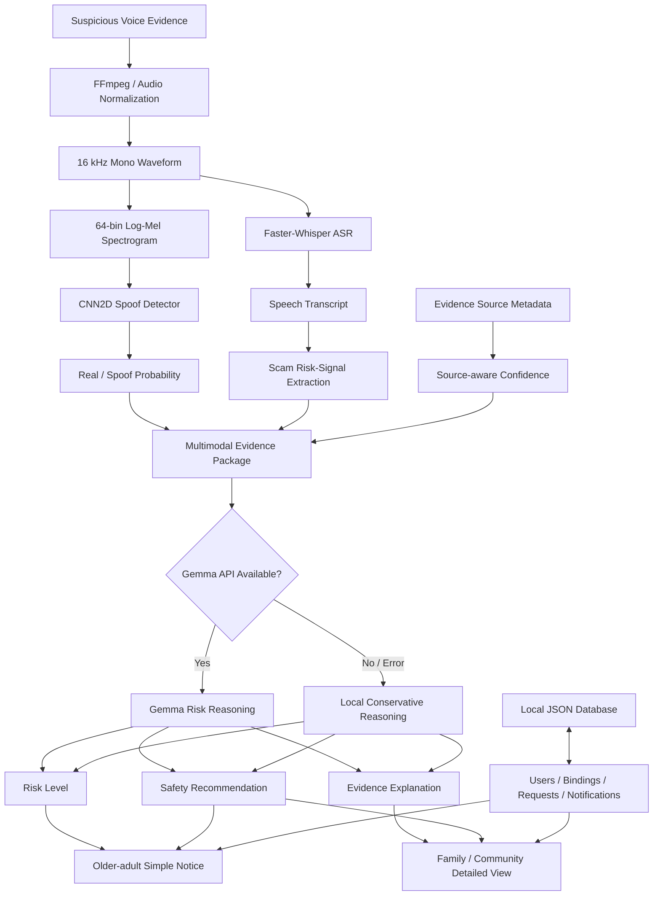
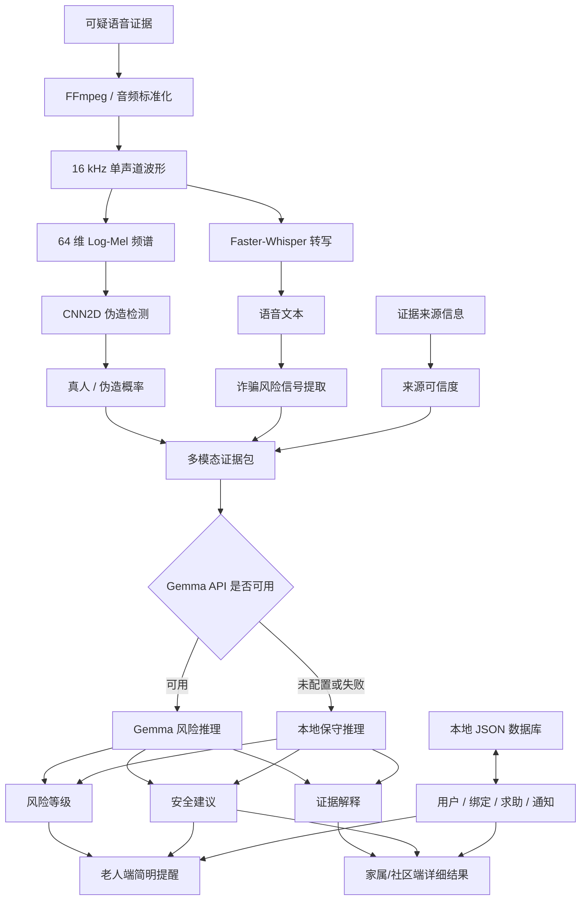

# 🛡️ AI Voice Safety Agent

<p align="center">
  <strong>A multimodal AI safety system for voice spoof detection, scam-risk reasoning, and trusted human assistance.</strong>
</p>

<p align="center">
  <strong>AI 语音伪造检测 × 语音转写 × 大模型风险推理 × 老人—家属/社区协同防护</strong>
</p>

<p align="center">
  <a href="https://huggingface.co/spaces/Laura-smith/voice-spoof-detector">🌐 Live Demo</a>
  ·
  <a href="#demo">🎥 Demo</a>
  ·
  <a href="#research-findings">🔬 Research Findings</a>
  ·
  <a href="#quick-start">⚙️ Quick Start</a>
</p>

<p align="center">
  <a href="#english">English</a>
  ·
  <a href="#中文">中文</a>
</p>

<p align="center">
  
  
  
  
  
</p>

> [!IMPORTANT]
> This repository is a research and engineering prototype. It provides supporting evidence and safety recommendations, but it must not be treated as a final legal, financial, identity-verification, or law-enforcement decision system.

---

<a id="english"></a>

# English

## Table of Contents

- [Project Overview](#project-overview)
- [Why This Project Matters](#why-this-project-matters)
- [From a Classifier to a Safety System](#from-a-classifier-to-a-safety-system)
- [Core Features](#core-features)
- [User Roles and Workflow](#user-roles-and-workflow)
- [Screenshots](#screenshots)
- [Demo](#demo)
- [System Architecture](#system-architecture)
- [AI Analysis Pipeline](#ai-analysis-pipeline)
- [CNN Model](#cnn-model)
- [Research Findings](#research-findings)
- [Deployment Strategy](#deployment-strategy)
- [Technology Stack](#technology-stack)
- [Repository Structure](#repository-structure)
- [Quick Start](#quick-start)
- [Training](#training)
- [Configuration](#configuration)
- [Data, Privacy, and Responsible Use](#data-privacy-and-responsible-use)
- [Limitations](#limitations)
- [Future Work](#future-work)
- [What This Project Demonstrates](#what-this-project-demonstrates)
- [Author and License](#author-and-license)

---

<a id="project-overview"></a>

## 1. Project Overview

**AI Voice Safety Agent** is the open-source engineering repository for the product prototype **GemmaShield**.

GemmaShield is a multimodal AI safety system designed to help older adults, family members, and community workers respond to suspicious voice messages or calls. It combines:

- CNN-based voice spoof detection;
- Faster-Whisper speech transcription;
- scam-related signal extraction;
- source-aware evidence confidence;
- Gemma-based risk reasoning;
- conservative local fallback reasoning;
- an older-adult interface;
- a family/community helper interface;
- trusted-contact binding and assistance workflows.

The project originally started as a binary classifier for distinguishing AI-generated speech from genuine human speech. Real-world testing revealed that strong benchmark performance did not transfer reliably to mobile recordings, replay channels, compression, microphone variation, and unseen spoofing conditions.

That finding changed the project from a single-model demo into a human-centered safety system.

The current design does **not** treat the CNN as the final decision-maker. Instead, the CNN output is used as acoustic evidence and is combined with transcript content, behavioral risk signals, evidence-source reliability, LLM reasoning, and human verification.

---

<a id="why-this-project-matters"></a>

## 2. Why This Project Matters

Traditional voice spoof detectors often return only a number:

```text
Fake probability: 0.82
```

For a non-technical user, especially an older adult, this does not answer the most important questions:

- Why might this audio be suspicious?
- Is the caller creating urgency or emotional pressure?
- Is the caller asking for money, passwords, or verification codes?
- How reliable is the current audio evidence?
- Should the user hang up?
- Who should be contacted for help?
- What should happen when the model is uncertain?

AI Voice Safety Agent converts raw model outputs into understandable and actionable safety guidance.

The project follows one central principle:

> A safety-oriented AI system should not only make a prediction. It should communicate uncertainty, explain the evidence, and connect vulnerable users with trusted humans.

---

<a id="from-a-classifier-to-a-safety-system"></a>

## 3. From a Classifier to a Safety System

The first version of this project focused on:

```text
Audio
  ↓
CNN
  ↓
Real / Fake
```

The current version implements a broader workflow:

```text
Suspicious audio
  ↓
Audio normalization
  ↓
CNN acoustic evidence + Whisper transcript
  ↓
Risk-signal extraction + evidence-source assessment
  ↓
Gemma or conservative local reasoning
  ↓
Risk explanation and safety recommendation
  ↓
Older adult + trusted family/community helper
```

This evolution reflects a key engineering lesson:

> When a model is imperfect under domain shift, product design, uncertainty communication, access control, and human escalation become part of the safety solution.

---

<a id="core-features"></a>

## 4. Core Features

### AI and audio analysis

- 16 kHz mono audio normalization;
- fixed-length waveform processing;
- 64-bin Log-Mel spectrogram extraction;
- CNN2D real/spoof probability estimation;
- Faster-Whisper transcription;
- scam-related keyword and behavior-signal extraction;
- source-aware evidence confidence;
- multi-level risk classification:
  - `HIGH`;
  - `MEDIUM`;
  - `VERIFY`;
  - `LOW`;
- Gemma-based structured risk explanation;
- local conservative reasoning when the Gemma API is unavailable.

### Product and workflow features

- older-adult and helper account roles;
- phone-based demo OTP flow;
- six-digit trusted-contact binding code;
- helper binding request;
- older-adult approval or rejection;
- up to five trusted helpers for one older user;
- one-click assistance request;
- helper inbox and evidence review;
- permission control for requests;
- unbinding and contact replacement;
- simulated SMS, WeChat, and app-push notification records;
- local JSON persistence for the prototype;
- health-status endpoint;
- Hugging Face Spaces deployment.

### Human-centered design

- large text and high-contrast interface;
- Chinese-first current user experience;
- simplified older-adult output;
- detailed helper-side evidence;
- conservative warnings when evidence is uncertain;
- human verification instead of automatic “safe” decisions.

---

<a id="user-roles-and-workflow"></a>

## 5. User Roles and Workflow

### 5.1 Older-adult side

The older adult can:

1. complete a simple first-time setup;
2. obtain a six-digit binding code;
3. approve trusted family or community helpers;
4. record or upload suspicious audio;
5. send a one-click assistance request;
6. view a simple safety notice;
7. review previous assistance requests;
8. replace or unbind trusted contacts when needed.

The older-adult interface intentionally avoids requiring the user to interpret technical model scores.

### 5.2 Family/community helper side

A trusted helper can:

1. register or log in through the demo phone flow;
2. enter the older adult’s six-digit binding code;
3. submit a binding request;
4. wait for the older adult’s approval;
5. receive and review assistance requests;
6. inspect the audio source and existing evidence;
7. upload clearer or additional evidence;
8. run the first-stage CNN + Whisper scan;
9. run the second-stage Gemma reasoning process;
10. review the detailed report and provide human assistance.

### 5.3 Two-stage analysis

The system separates fast evidence extraction from deeper reasoning:

```text
Stage 1
CNN spoof detection
+
Faster-Whisper transcription
+
risk-signal extraction
+
evidence-source confidence

Stage 2
Gemma multimodal risk reasoning
or
local conservative fallback reasoning
```

This design keeps the core workflow available even when the external LLM service is unavailable.

---

<a id="screenshots"></a>

## 6. Screenshots

### Home Page

<p align="center">
  
</p>

### Older-adult and Family/Community Interfaces

<p align="center">
  
</p>

> The complete workflow contains multiple states, including registration, binding, approval, assistance requests, evidence review, two-stage analysis, and final feedback. A full video is used to demonstrate the end-to-end interaction.

---

<a id="demo"></a>

## 7. Demo

### Live Application

[Open the Hugging Face Space](https://huggingface.co/spaces/Laura-smith/voice-spoof-detector)

### Full Workflow Video

[Watch the complete demo video](assets/demo-video.mp4)

The full video should demonstrate:

1. older-adult account setup;
2. helper account setup;
3. six-digit binding request;
4. older-adult approval;
5. one-click assistance request;
6. audio recording or upload;
7. first-stage CNN + Whisper analysis;
8. helper-side evidence review;
9. Gemma reasoning;
10. final safety response.

> If the Hugging Face Space is temporarily inaccessible because of regional or network restrictions, use the local deployment instructions or the recorded demo video.

---

<a id="system-architecture"></a>

## 8. System Architecture



### Application layers

| Layer | Responsibility |
|---|---|
| Input layer | Recorded or uploaded voice evidence |
| Acoustic layer | CNN-based real/spoof estimation |
| Semantic layer | Faster-Whisper transcription and risk-signal extraction |
| Confidence layer | Evidence-source reliability and deployment caution |
| Reasoning layer | Gemma structured reasoning or local fallback |
| Workflow layer | Account roles, binding, requests, permissions, notifications |
| Interaction layer | Older-adult and family/community interfaces |

---

<a id="ai-analysis-pipeline"></a>

## 9. AI Analysis Pipeline

### 9.1 Audio normalization

Audio is converted to:

```text
Sample rate: 16,000 Hz
Channels: mono
Target length: 64,000 samples
Approximate analyzed duration: 4 seconds
```

The waveform is standardized before feature extraction. FFmpeg is used when format conversion is required.

### 9.2 Log-Mel feature extraction

The CNN receives a normalized Log-Mel spectrogram:

```text
n_fft: 1024
hop_length: 512
n_mels: 64
```

### 9.3 CNN acoustic evidence

The CNN outputs a binary logit that is converted using a sigmoid function:

```text
Real probability = sigmoid(logit)
Spoof probability = 1 - Real probability
```

The score is treated as supporting acoustic evidence rather than a final safety verdict.

### 9.4 Faster-Whisper transcription

Faster-Whisper extracts spoken content for semantic analysis.

The current implementation uses the `tiny` model on CPU with `int8` computation to keep the Hugging Face deployment lightweight.

### 9.5 Risk-signal extraction

The system checks for signals such as:

- money transfers;
- bank-account requests;
- verification codes;
- passwords;
- urgency and immediate-action pressure;
- family impersonation;
- investment or profit promises;
- secrecy instructions.

These rules are not a replacement for semantic reasoning. They provide structured context for the final assessment.

### 9.6 Evidence-source confidence

The system distinguishes different evidence sources because acoustic reliability changes across recording channels.

| Evidence source | Current confidence treatment | Main concern |
|---|---|---|
| Older-adult browser/microphone recording | Human review required | Playback device, room noise, distance, re-recording |
| Older-adult uploaded audio | Medium | Unknown compression or source |
| Social-media voice message | Medium | Platform compression |
| Voicemail | Medium | Channel and codec effects |
| Saved call recording | Relatively high | Still affected by call-channel processing |
| Helper-uploaded evidence | Relatively high | Depends on the original source |

A low spoof score from a microphone re-recording is therefore not automatically displayed as safe.

### 9.7 Risk levels

| Level | Meaning |
|---|---|
| `HIGH` | Strong spoof evidence or a combination of spoof evidence and high-risk content |
| `MEDIUM` | Uncertain acoustic evidence or suspicious semantic signals |
| `VERIFY` | No strong high-risk signal, but the evidence source is not reliable enough for a safe conclusion |
| `LOW` | No obvious high-risk signal under the available evidence; continued caution is still required |

### 9.8 Gemma reasoning

Gemma receives:

- real and spoof probabilities;
- transcript;
- preliminary risk level;
- risk type;
- detected risk signals;
- evidence-source label;
- source-confidence note.

It produces a structured report containing:

1. risk level;
2. reason for the risk;
3. acoustic evidence;
4. textual evidence;
5. advice for the older adult;
6. advice for the family/community helper;
7. a one-sentence warning.

Gemma is used as a reasoning and communication layer. It does **not** “correct” the CNN and is not presented as a final authority.

### 9.9 Local fallback reasoning

If:

- `HF_TOKEN` is not configured;
- the Gemma client cannot be created;
- the API call fails;
- the returned content is invalid;

the system generates a conservative local safety report.

This fallback preserves the basic safety workflow and avoids making the application completely dependent on one external service.

---

<a id="cnn-model"></a>

## 10. CNN Model

### Input

```text
Shape: [batch, 1, 64, time]
Representation: normalized 64-bin Log-Mel spectrogram
```

### Architecture

```text
Conv2D: 1 → 32
BatchNorm2D
ReLU
MaxPool2D

Conv2D: 32 → 64
BatchNorm2D
ReLU
MaxPool2D

Conv2D: 64 → 128
ReLU

AdaptiveAvgPool2D: 1 × 1
Flatten

Linear: 128 → 64
ReLU
Linear: 64 → 1
```

### Objective and evaluation

- training loss: `BCEWithLogitsLoss`;
- optimizer: Adam;
- task: binary real/spoof classification;
- primary reported research metric: Equal Error Rate (`EER`);
- lower EER indicates better balance between false-accept and false-reject error rates.

---

<a id="research-findings"></a>

## 11. Research Findings

### 11.1 Research question

The central research question was:

> Does strong performance on a controlled anti-spoofing benchmark transfer to mobile recordings and realistic deployment conditions?

### 11.2 Benchmark evaluation

The CNN was trained and evaluated using the ASVspoof research dataset.

Under the controlled benchmark setting, the reported result was:

```text
ASVspoof benchmark EER: 0.00134
```

This result showed that the model could perform strongly when the training and evaluation conditions were closely matched.

### 11.3 Real-world evaluation

To study deployment robustness, approximately 100 additional real-world recordings were collected for testing.

The evaluation included conditions such as:

- mobile phone recording;
- replayed audio;
- AI-generated speech;
- microphone variation;
- environmental noise;
- compression and transmission effects.

The initial real-world result was:

```text
Initial real-world EER: 0.30
```

The large increase in EER exposed a significant domain gap between clean benchmark evaluation and practical audio conditions.

### 11.4 Data augmentation and transfer learning

Because the real-world dataset was small, an augmentation pipeline expanded approximately 100 original samples into about:

```text
50,000 augmented samples
```

The experimental augmentation process included:

- noise injection;
- pitch shifting;
- replay simulation;
- frequency perturbation;
- audio distortion;
- waveform modification.

The ASVspoof-pretrained CNN was then adapted through transfer learning and fine-tuning.

The reported result after augmentation and adaptation was:

```text
Augmented and fine-tuned EER: 0.03
```

### 11.5 Experimental summary

| Evaluation setting | EER | Interpretation |
|---|---:|---|
| ASVspoof benchmark | 0.00134 | Strong matched-condition benchmark result |
| Initial real-world recordings | 0.30 | Severe degradation under domain shift |
| Augmented and fine-tuned evaluation | 0.03 | Major improvement, but not a production guarantee |

### 11.6 Key finding

> Extremely low benchmark EER does not guarantee real-world robustness.

The experiments indicate that anti-spoofing performance can be strongly affected by:

- dataset mismatch;
- microphone and device differences;
- replay channels;
- room acoustics;
- codec and compression effects;
- environmental noise;
- unseen voice-generation methods.

Data augmentation and transfer learning substantially improved the measured EER, but real-world robustness remains an open research and deployment challenge.

### 11.7 Interpretation caution

The three EER values come from different evaluation settings and should not be interpreted as a universal production-performance guarantee.

The real contribution of the experiment is not only the improved metric. It is the identification of the gap between:

```text
benchmark success
and
deployment reliability
```

This finding directly informed the product design:

- the CNN is treated as evidence, not a final judge;
- evidence source is shown explicitly;
- uncertain cases receive a `VERIFY` result;
- transcript and scam signals are considered;
- a trusted human is included in the workflow.

---

<a id="deployment-strategy"></a>

## 12. Deployment Strategy

The current deployment follows a conservative strategy:

```text
CNN acoustic evidence
+
Whisper semantic evidence
+
risk-signal extraction
+
evidence-source confidence
+
Gemma/local reasoning
+
human verification
```

The system avoids the following unsafe design:

```text
Low spoof probability
=
Automatically safe
```

Instead, it uses:

```text
Low spoof probability
+
weak evidence source
=
Needs verification
```

This is especially important for browser microphone recordings and replayed audio.

---

<a id="technology-stack"></a>

## 13. Technology Stack

| Component | Technology |
|---|---|
| Programming language | Python |
| Backend | FastAPI |
| Application server | Uvicorn |
| Deep-learning framework | PyTorch |
| Audio processing | Torchaudio, SoundFile, FFmpeg |
| Acoustic feature | 64-bin Log-Mel spectrogram |
| Spoof detector | Custom CNN2D |
| Speech recognition | Faster-Whisper |
| LLM reasoning | Google Gemma through Hugging Face Inference Client |
| Prototype persistence | Local JSON file |
| Prototype notifications | Simulated SMS / WeChat / app push |
| Deployment | Hugging Face Spaces |
| Evaluation | EER using scikit-learn ROC utilities |

---

<a id="repository-structure"></a>

## 14. Repository Structure

The following structure keeps the current imports and checkpoint path simple:

```text
AI-Voice-Safety-Agent/
│
├── app.py
├── model.py
├── train.py
├── best_model.pth
├── requirements.txt
├── README.md
├── LICENSE
├── .gitignore
│
├── assets/
│   ├── homepage.png
│   ├── role-interfaces.png
│   └── demo-video.mp4
│
├── docs/
│   ├── experiment-notes.md
│   └── system-design.md
│
├── experiments/
│   └── README.md
│
└── sample_audio/
    └── README.md
```

### File descriptions

| File or directory | Purpose |
|---|---|
| `app.py` | FastAPI application, UI, authentication demo, binding, requests, analysis, and reasoning workflow |
| `model.py` | CNN2D architecture |
| `train.py` | model training and evaluation pipeline |
| `best_model.pth` | trained CNN checkpoint used by the application |
| `assets/` | screenshots and demo video |
| `docs/` | design and research documentation |
| `experiments/` | reproducible experiment notes, metrics, and future scripts |
| `sample_audio/` | consented or synthetic public demo samples only |

> If `best_model.pth` is larger than GitHub’s normal file-size limit, use Git LFS or host the checkpoint through a release/model repository and document the download location.

---

<a id="quick-start"></a>

## 15. Quick Start

### 15.1 Prerequisites

Recommended:

- Python 3.10 or later;
- FFmpeg installed and available from the command line;
- enough memory to load Faster-Whisper and the CNN;
- a Hugging Face token for Gemma API reasoning.

### 15.2 Clone the repository

```bash
git clone https://github.com/lwenxuan420-lgtm/AI-Voice-Safety-Agent.git
cd AI-Voice-Safety-Agent
```

### 15.3 Create a virtual environment

#### Windows PowerShell

```powershell
python -m venv .venv
.venv\Scripts\Activate.ps1
```

#### macOS / Linux

```bash
python3 -m venv .venv
source .venv/bin/activate
```

### 15.4 Install Python dependencies

```bash
pip install --upgrade pip
pip install -r requirements.txt
```

A suitable `requirements.txt` should include the packages used by both the application and training pipeline, for example:

```text
fastapi
uvicorn[standard]
python-multipart
torch
torchaudio
soundfile
faster-whisper
huggingface-hub
numpy
pandas
scikit-learn
tqdm
```

For reproducible deployment, replace unpinned dependencies with the versions tested in your environment.

### 15.5 Install FFmpeg

Verify that FFmpeg is available:

```bash
ffmpeg -version
```

### 15.6 Add the checkpoint

Place the trained checkpoint here:

```text
AI-Voice-Safety-Agent/best_model.pth
```

The current application expects the checkpoint to be in the same directory as `app.py`.

### 15.7 Configure Gemma access

#### Windows PowerShell

```powershell
$env:HF_TOKEN="your_hugging_face_token"
$env:GEMMA_MODEL_ID="google/gemma-4-26B-A4B-it"
$env:GEMMA_PROVIDER="deepinfra"
```

#### macOS / Linux

```bash
export HF_TOKEN="your_hugging_face_token"
export GEMMA_MODEL_ID="google/gemma-4-26B-A4B-it"
export GEMMA_PROVIDER="deepinfra"
```

The application can still run without `HF_TOKEN`, but the second-stage report will use local conservative reasoning instead of the Gemma API.

### 15.8 Start the application

```bash
python app.py
```

Open:

```text
http://localhost:7860
```

Available pages include:

```text
/          Home
/elder     Older-adult side
/helper    Family/community side
/health    Runtime status
```

---

<a id="training"></a>

## 16. Training

### 16.1 Dataset paths

The provided training script uses local dataset and CSV paths. Update these values before training:

```python
ASV_ROOTS = [...]
ASV_CSV = "..."

PHONE_ROOTS = [...]
PHONE_CSV = "..."
```

Do not commit private local paths, raw personal recordings, or unlicensed datasets to the public repository.

### 16.2 Training pipeline

The current training workflow includes:

1. loading waveform files and binary labels;
2. stereo-to-mono conversion;
3. resampling to 16 kHz;
4. waveform normalization;
5. padding or truncation to 64,000 samples;
6. 64-bin Log-Mel feature extraction;
7. feature normalization;
8. CNN training with `BCEWithLogitsLoss`;
9. validation using EER;
10. saving the checkpoint with the best validation EER.

### 16.3 Run training

```bash
python train.py
```

### 16.4 Reproducibility note

For a fully reproducible research release, future repository updates should document:

- exact ASVspoof subset and protocol;
- train/validation/test split;
- random seeds;
- augmentation probabilities and parameters;
- transfer-learning layer-freezing policy;
- checkpoint-selection rule;
- per-condition and cross-domain results;
- confidence intervals or repeated-run variance.

---

<a id="configuration"></a>

## 17. Configuration

### Core environment variables

| Variable | Required | Default or behavior |
|---|---:|---|
| `HF_TOKEN` | No | Without it, local fallback reasoning is used |
| `GEMMA_MODEL_ID` | No | `google/gemma-4-26B-A4B-it` |
| `GEMMA_PROVIDER` | No | `deepinfra` |
| `TORCH_NUM_THREADS` | No | `2` |
| `PORT` | No | `7860` |

### Optional notification variables

| Variable | Purpose |
|---|---|
| `SMS_API_KEY` | marks the SMS provider hook as configured |
| `WECHAT_APP_ID` | WeChat provider configuration |
| `WECHAT_APP_SECRET` | WeChat provider configuration |
| `PUSH_API_KEY` | marks the app-push provider hook as configured |

The current public prototype records simulated notification delivery. Production integration requires real provider-specific request signing, error handling, consent, rate limits, and security controls.

---

<a id="data-privacy-and-responsible-use"></a>

## 18. Data, Privacy, and Responsible Use

### 18.1 Dataset use

The model research uses the ASVspoof public research dataset and separately collected real-world evaluation samples.

Any public sample audio should be:

- synthetic;
- openly licensed;
- or collected with clear participant consent.

### 18.2 Current prototype storage

The current prototype uses:

```text
requests_db.json
uploads/
```

to store demo users, sessions, binding requests, assistance requests, notifications, and uploaded evidence locally.

This architecture is suitable only for a prototype.

Do not use real sensitive information in the public demo.

### 18.3 Production requirements

A production deployment would require:

- explicit informed consent;
- secure authentication;
- encrypted transport and storage;
- role-based access control;
- secure secret management;
- audio-retention and deletion policies;
- user-controlled deletion;
- audit logging;
- abuse monitoring;
- data minimization;
- compliance review for the deployment region;
- a production database such as PostgreSQL or a managed equivalent;
- secure object storage instead of an unprotected local upload directory.

### 18.4 Intended use

This project is intended for:

- AI safety research;
- voice spoofing research;
- educational demonstration;
- human-centered AI engineering;
- scam-risk assistance;
- prototyping trusted-helper workflows.

### 18.5 Out-of-scope use

This project must not be used for:

- surveillance;
- unauthorized speaker identification;
- identity tracking;
- secretly recording private calls;
- automatic legal or financial decisions;
- claiming that a person is a criminal;
- replacing banks, police, emergency services, or professional advice;
- presenting a low model score as proof that an audio sample is safe.

---

<a id="limitations"></a>

## 19. Limitations

Current limitations include:

- real-world spoof detection remains challenging;
- unseen generation methods may reduce performance;
- microphone re-recording can hide spoof artifacts;
- replay channels and codecs introduce domain shift;
- noisy audio may reduce transcription quality;
- keyword rules may miss indirect or novel scam language;
- Gemma output depends on the quality of the transcript and evidence;
- the demo OTP flow is not production authentication;
- notifications are simulated unless real providers are integrated;
- local JSON storage is not suitable for production scale or security;
- uploaded audio is stored locally in the current prototype;
- the UI is currently Chinese-first rather than fully multilingual;
- the CNN analyzes a fixed audio window rather than a complete streaming call;
- EER results from experimental settings are not production guarantees;
- the system assists human judgment and cannot establish authenticity with certainty.

---

<a id="future-work"></a>

## 20. Future Work

### Research

- cross-dataset evaluation;
- unseen-attack generalization;
- domain adaptation;
- domain generalization;
- self-supervised speech representations;
- one-class or anomaly-based detection;
- replay-channel simulation;
- calibration and uncertainty estimation;
- per-condition robustness analysis;
- larger consented real-world datasets;
- more rigorous augmentation ablation studies.

### Engineering

- modular service architecture;
- PostgreSQL or Supabase persistence;
- secure object storage;
- real SMS, WeChat, and app-push integration;
- background job queue;
- structured monitoring and observability;
- model-version tracking;
- audit logs;
- automated testing;
- containerized deployment;
- CI/CD pipeline;
- streaming and long-audio analysis;
- mobile and edge deployment.

### Product

- complete English and multilingual UI;
- accessibility testing with older adults;
- user testing with families and community workers;
- clearer uncertainty visualization;
- emergency escalation policy;
- configurable trusted-helper roles;
- institutional dashboard for senior-care organizations;
- function calling for safe, permission-controlled actions.

---

<a id="what-this-project-demonstrates"></a>

## 21. What This Project Demonstrates

This repository documents more than a model-training experiment. It demonstrates an end-to-end AI application workflow:

```text
Real problem discovery
  ↓
Dataset and model development
  ↓
Benchmark evaluation
  ↓
Real-world failure discovery
  ↓
Domain-gap analysis
  ↓
Augmentation and adaptation
  ↓
Risk-aware product redesign
  ↓
Backend and workflow implementation
  ↓
Human-centered deployment
```

The project brings together:

- machine learning;
- audio processing;
- model evaluation;
- API integration;
- LLM reasoning;
- backend development;
- workflow design;
- access control;
- deployment;
- responsible AI;
- human-centered product thinking.

The most important outcome is not a single metric. It is the ability to identify a model’s limitations and redesign the surrounding system so that uncertainty is visible and trusted humans remain involved.

---

<a id="author-and-license"></a>

## 22. Author and License

Maintainer:

- GitHub: [lwenxuan420-lgtm](https://github.com/lwenxuan420-lgtm)

Project areas:

- AI Safety;
- Voice Security;
- Deepfake Speech Detection;
- Explainable AI;
- Multimodal AI Systems;
- Human-Centered AI;
- AI Application Engineering.

This project is released under the [MIT License](LICENSE).

---

<a id="中文"></a>

# 中文

## 目录

- [项目概述](#项目概述)
- [为什么要做这个项目](#为什么要做这个项目)
- [从真假分类器到安全协同系统](#从真假分类器到安全协同系统)
- [核心功能](#核心功能-1)
- [用户角色与工作流程](#用户角色与工作流程)
- [系统截图](#系统截图)
- [演示](#演示)
- [系统架构](#系统架构-1)
- [AI 分析流程](#ai-分析流程)
- [CNN 模型](#cnn-模型)
- [研究发现](#研究发现)
- [当前部署策略](#当前部署策略)
- [技术栈](#技术栈)
- [项目结构](#项目结构)
- [本地运行](#本地运行)
- [模型训练](#模型训练)
- [配置项](#配置项)
- [数据隐私与负责任使用](#数据隐私与负责任使用)
- [当前局限](#当前局限)
- [未来计划](#未来计划)
- [项目所体现的能力](#项目所体现的能力)
- [作者与许可证](#作者与许可证)

---

<a id="项目概述"></a>

## 1. 项目概述

**AI Voice Safety Agent** 是产品原型 **GemmaShield** 的开源工程仓库。

GemmaShield 是一个面向老年人、家属和社区工作人员的多模态 AI 语音安全系统，用于协助处理可疑语音消息或电话证据。系统融合：

- 基于 CNN 的 AI 语音伪造检测；
- Faster-Whisper 语音转写；
- 诈骗风险信号提取；
- 基于证据来源的置信度判断；
- Gemma 风险推理；
- Gemma 不可用时的本地保守推理；
- 老人端页面；
- 家属/社区端页面；
- 可信协助人绑定和求助流程。

项目最初只是一个区分 AI 合成语音与真人语音的二分类系统。

但在真实世界测试中，我们发现：模型在公开 benchmark 上取得的优秀结果，并不能稳定迁移到手机录音、重放、压缩、麦克风差异和未知伪造方式中。

这一发现改变了项目方向。

现在的系统不再将 CNN 输出当成最终裁决，而是把它作为一项声音证据，并与以下信息结合：

- 语音转录文本；
- 诈骗行为信号；
- 证据来源可靠性；
- 大模型风险推理；
- 家属或社区人员的人工核实。

因此，这个项目同时探索两个问题：

1. **语音深度伪造检测的真实世界泛化问题**；
2. **当 AI 模型并不完美时，如何设计更加安全的人机协同系统**。

---

<a id="为什么要做这个项目"></a>

## 2. 为什么要做这个项目

传统语音伪造检测系统通常只输出一个数字：

```text
AI 伪造概率：0.82
```

但对于普通用户，尤其是老年人，这个数字无法回答真正重要的问题：

- 为什么这段语音可疑？
- 对方是否在制造紧急感或情绪压力？
- 对方是否要求转账、银行卡、密码或验证码？
- 当前音频证据是否可靠？
- 老人是否应该立刻挂断？
- 应该向谁求助？
- 当模型不确定时，系统应该怎么做？

AI Voice Safety Agent 的目标，是把原始模型输出转化为用户能够理解和执行的安全建议。

项目遵循一个核心原则：

> 一个面向安全场景的 AI 系统，不应该只给出预测，还应该说明不确定性、解释证据，并把脆弱用户连接到可信的人类协助者。

---

<a id="从真假分类器到安全协同系统"></a>

## 3. 从真假分类器到安全协同系统

项目最初的流程是：

```text
音频
  ↓
CNN
  ↓
真人 / AI 伪造
```

当前系统的流程变为：

```text
可疑语音
  ↓
音频标准化
  ↓
CNN 声学证据 + Whisper 转录文本
  ↓
诈骗信号提取 + 证据来源判断
  ↓
Gemma 推理或本地保守推理
  ↓
风险解释与安全建议
  ↓
老人 + 可信家属/社区人员共同处理
```

这一变化体现了项目最重要的工程认识：

> 当模型在 Domain Shift 下并不可靠时，产品流程、不确定性表达、权限控制和人工升级机制，本身就是安全方案的一部分。

---

<a id="核心功能-1"></a>

## 4. 核心功能

### AI 与音频分析

- 将音频转换为 16 kHz 单声道；
- 固定长度波形处理；
- 64 维 Log-Mel 频谱特征提取；
- CNN2D 输出真人/伪造概率；
- Faster-Whisper 语音转写；
- 诈骗关键词与行为信号提取；
- 根据证据来源调整可信度表达；
- 四级风险结果：
  - `HIGH`：高风险；
  - `MEDIUM`：谨慎；
  - `VERIFY`：需要核实；
  - `LOW`：相对安全；
- Gemma 生成结构化风险解释；
- Gemma API 不可用时启用本地保守推理。

### 产品与业务流程

- 老人和协助人两类账号；
- 手机号 Demo 验证码流程；
- 六位数字绑定码；
- 协助人提交绑定申请；
- 老人确认或拒绝；
- 一位老人最多绑定五名可信协助人；
- 老人一键发起求助；
- 协助人收件箱和证据查看；
- 求助请求权限控制；
- 解绑和更换可信联系人；
- 模拟短信、微信公众号和 App Push 通知；
- 本地 JSON Demo 数据库；
- Health 运行状态接口；
- Hugging Face Spaces 部署。

### 面向老年人的设计

- 大字体和高对比度界面；
- 当前以中文交互为主；
- 老人端输出保持简单；
- 家属/社区端展示更详细的证据；
- 证据不足时不直接输出“安全”；
- 保留人工核实和最终判断。

---

<a id="用户角色与工作流程"></a>

## 5. 用户角色与工作流程

### 5.1 老人端

老人可以：

1. 完成简单的首次设置；
2. 获得六位数字绑定码；
3. 确认可信家属或社区工作人员；
4. 现场录音或上传可疑音频；
5. 一键发起求助；
6. 查看简单明确的风险提醒；
7. 查看历史求助记录；
8. 在需要时解绑或更换可信联系人。

老人端不会要求老人理解复杂的模型分数。

### 5.2 家属/社区端

可信协助人可以：

1. 通过手机号 Demo 流程注册或登录；
2. 输入老人端显示的六位数字；
3. 提交绑定申请；
4. 等待老人确认；
5. 接收并查看老人求助；
6. 检查音频来源和已有证据；
7. 上传更清晰或额外的音频；
8. 执行第一阶段 CNN + Whisper 分析；
9. 执行第二阶段 Gemma 风险推理；
10. 查看完整报告并帮助老人完成最终核实。

### 5.3 两阶段分析

```text
第一阶段
CNN 语音伪造检测
+
Faster-Whisper 语音转写
+
诈骗风险信号提取
+
证据来源可信度判断

第二阶段
Gemma 多模态风险推理
或
本地保守推理
```

即使外部大模型服务暂时不可用，基础安全流程也能够继续运行。

---

<a id="系统截图"></a>

## 6. 系统截图

### 首页

<p align="center">
  
</p>

### 老人端与家属/社区端

<p align="center">
  
</p>

> 完整系统包含注册、绑定、老人确认、求助、证据查看、两阶段分析和最终反馈等多个状态，因此项目使用视频展示完整 Demo 流程。

---

<a id="演示"></a>

## 7. 演示

### 在线系统

[打开 Hugging Face Space](https://huggingface.co/spaces/Laura-smith/voice-spoof-detector)

### 完整操作视频

[查看完整 Demo 视频](assets/demo-video.mp4)

完整视频建议展示：

1. 老人账号首次设置；
2. 协助人账号设置；
3. 六位数字绑定申请；
4. 老人确认绑定；
5. 老人一键发起求助；
6. 现场录音或上传音频；
7. CNN + Whisper 第一阶段分析；
8. 家属/社区端查看证据；
9. Gemma 风险推理；
10. 最终安全建议。

> 如果 Hugging Face Space 因地区或网络原因暂时无法打开，可以使用本地运行方式或查看录制视频。

---

<a id="系统架构-1"></a>

## 8. 系统架构



### 系统分层

| 层级 | 作用 |
|---|---|
| 输入层 | 录制或上传可疑语音证据 |
| 声学层 | CNN 输出真人/伪造概率 |
| 语义层 | Whisper 转写和诈骗信号提取 |
| 可信度层 | 判断证据来源和使用限制 |
| 推理层 | Gemma 结构化推理或本地降级推理 |
| 业务流程层 | 账号、绑定、求助、权限和通知 |
| 交互层 | 老人端和家属/社区端 |

---

<a id="ai-分析流程"></a>

## 9. AI 分析流程

### 9.1 音频标准化

系统将音频处理为：

```text
采样率：16,000 Hz
声道：单声道
固定长度：64,000 个采样点
分析时长：约 4 秒
```

当音频格式需要转换时，系统使用 FFmpeg。

### 9.2 Log-Mel 特征

CNN 的输入为标准化后的 Log-Mel 频谱：

```text
n_fft：1024
hop_length：512
n_mels：64
```

### 9.3 CNN 声学证据

CNN 输出一个二分类 logit，经过 sigmoid 后得到：

```text
真人概率 = sigmoid(logit)
AI 伪造概率 = 1 - 真人概率
```

系统把该结果定义为辅助声学证据，而不是最终安全判断。

### 9.4 Faster-Whisper 转写

系统使用 Faster-Whisper 提取语音文本。

当前部署使用 CPU 上的 `tiny` 模型和 `int8` 计算，以降低 Hugging Face 环境中的资源开销。

### 9.5 风险信号提取

系统会检查：

- 转账和资金；
- 银行账户；
- 验证码；
- 密码；
- 立即、马上等紧急施压；
- 冒充家属；
- 投资和高收益承诺；
- 要求保密等诈骗行为信号。

规则信号并不能替代语义推理，而是为后续综合判断提供结构化信息。

### 9.6 证据来源可信度

同一段内容经过不同方式保存后，声学可靠性可能完全不同。

| 证据来源 | 当前可信度处理 | 主要风险 |
|---|---|---|
| 老人端浏览器/麦克风录音 | 必须结合人工核实 | 播放设备、房间噪声、距离、重录 |
| 老人端上传音频 | 中等 | 来源和压缩未知 |
| 微信或社交软件语音 | 中等 | 平台压缩 |
| 语音留言 | 中等 | 信道和编码器影响 |
| 保存的通话录音 | 相对较高 | 仍受到电话信道处理 |
| 家属/社区端上传 | 相对较高 | 仍取决于原始来源 |

因此，现场麦克风重录即使获得较低的伪造概率，也不会被系统自动判定为安全。

### 9.7 风险等级

| 等级 | 含义 |
|---|---|
| `HIGH` | 出现较强伪造证据，或伪造证据与高风险话术同时出现 |
| `MEDIUM` | 声学证据不确定，或文本出现可疑信号 |
| `VERIFY` | 未发现明显高危信号，但证据来源不足以支持“安全”结论 |
| `LOW` | 当前证据中未发现明显高危信号，但仍需保持警惕 |

### 9.8 Gemma 风险推理

Gemma 接收：

- 真人和伪造概率；
- 转录文本；
- 初步风险等级；
- 风险类型；
- 风险行为信号；
- 证据来源；
- 证据可信度说明。

Gemma 输出：

1. 风险等级；
2. 为什么存在风险；
3. 声音证据；
4. 文本证据；
5. 给老人的建议；
6. 给家属/社区的处理建议；
7. 一句话提醒。

Gemma 的作用是综合推理与解释，不是“修正 CNN”，也不是最终裁决者。

### 9.9 本地降级推理

以下情况会触发本地保守推理：

- 没有配置 `HF_TOKEN`；
- Gemma 客户端初始化失败；
- API 请求失败；
- 大模型返回内容无效。

本地推理会根据声音概率、文本信号、风险等级和证据来源生成保守建议，保证系统不会因单个外部服务失败而完全不可用。

---

<a id="cnn-模型"></a>

## 10. CNN 模型

### 输入

```text
形状：[batch, 1, 64, time]
表示：标准化的 64 维 Log-Mel 频谱
```

### 模型结构

```text
Conv2D：1 → 32
BatchNorm2D
ReLU
MaxPool2D

Conv2D：32 → 64
BatchNorm2D
ReLU
MaxPool2D

Conv2D：64 → 128
ReLU

AdaptiveAvgPool2D：1 × 1
Flatten

Linear：128 → 64
ReLU
Linear：64 → 1
```

### 训练目标和指标

- 损失函数：`BCEWithLogitsLoss`；
- 优化器：Adam；
- 任务：真人/伪造二分类；
- 主要研究指标：Equal Error Rate（`EER`，等错误率）；
- EER 越低，说明错误接受率与错误拒绝率的平衡点越低。

---

<a id="研究发现"></a>

## 11. 研究发现

### 11.1 研究问题

项目的核心研究问题是：

> 在受控反欺骗 benchmark 上表现优秀的模型，能否直接迁移到手机录音和真实部署环境？

### 11.2 Benchmark 测试

CNN 使用 ASVspoof 研究数据集进行训练和评估。

在受控 benchmark 环境中，实验结果为：

```text
ASVspoof benchmark EER：0.00134
```

该结果说明，当训练和测试条件较为匹配时，模型能够获得很强的实验室表现。

### 11.3 真实世界测试

为了测试部署鲁棒性，项目额外收集并测试了约 100 条真实世界音频。

测试条件包括：

- 手机录音；
- 重放音频；
- AI 生成语音；
- 麦克风差异；
- 环境噪声；
- 压缩和传输影响。

初始真实世界结果为：

```text
真实世界初始 EER：0.30
```

EER 的大幅上升暴露出公开 benchmark 与真实手机音频之间明显的 Domain Gap。

### 11.4 数据增强与迁移学习

由于真实世界数据量有限，项目将约 100 条原始样本扩增到约：

```text
50,000 条增强样本
```

实验中的增强方式包括：

- 噪声注入；
- 音高变化；
- 重放模拟；
- 频率扰动；
- 音频失真；
- 波形修改。

随后保留 ASVspoof 预训练 CNN，并使用迁移学习和微调进行适配。

增强和适配后的实验结果为：

```text
增强与微调后 EER：0.03
```

### 11.5 实验结果汇总

| 测试设置 | EER | 解释 |
|---|---:|---|
| ASVspoof benchmark | 0.00134 | 训练与测试条件匹配时表现很强 |
| 初始真实世界录音 | 0.30 | Domain Shift 下性能严重下降 |
| 数据增强与微调后 | 0.03 | 获得显著改善，但不能代表生产环境保证 |

### 11.6 核心发现

> 极低的 benchmark EER 并不代表模型具备真实世界鲁棒性。

实验表明，语音伪造检测容易受到以下因素影响：

- 数据集不匹配；
- 麦克风和设备差异；
- 重放信道；
- 房间声学环境；
- 编码和压缩；
- 环境噪声；
- 未见过的语音生成方法。

数据增强和迁移学习显著改善了实验指标，但真实世界泛化依然是尚未完全解决的研究与部署问题。

### 11.7 指标解释说明

三组 EER 来自不同的实验设置，不能被当作对所有真实部署条件的统一性能承诺。

这组实验最重要的价值，不只是把某个指标从 0.30 降低到 0.03，而是发现了：

```text
Benchmark 成功
并不等于
真实部署可靠
```

这一结论直接改变了系统设计：

- CNN 只作为证据，不作为最终裁决；
- 系统明确展示音频证据来源；
- 不确定情况输出 `VERIFY`；
- 同时分析通话文本与诈骗行为信号；
- 引入可信家属或社区人员完成最终核实。

---

<a id="当前部署策略"></a>

## 12. 当前部署策略

当前系统采用保守的多证据策略：

```text
CNN 声学证据
+
Whisper 文本证据
+
诈骗信号
+
证据来源可信度
+
Gemma / 本地推理
+
人工核实
```

系统不会使用以下逻辑：

```text
AI 伪造概率低
=
一定安全
```

而是采用：

```text
AI 伪造概率低
+
证据来源不可靠
=
仍然需要核实
```

这一点对浏览器麦克风录音和重放音频尤其重要。

---

<a id="技术栈"></a>

## 13. 技术栈

| 组件 | 技术 |
|---|---|
| 编程语言 | Python |
| 后端 | FastAPI |
| 应用服务器 | Uvicorn |
| 深度学习框架 | PyTorch |
| 音频处理 | Torchaudio、SoundFile、FFmpeg |
| 声学特征 | 64 维 Log-Mel 频谱 |
| 语音伪造检测 | 自定义 CNN2D |
| 语音识别 | Faster-Whisper |
| 大模型推理 | Google Gemma + Hugging Face Inference Client |
| Demo 数据存储 | 本地 JSON |
| Demo 通知 | 模拟短信、微信和 App Push |
| 部署 | Hugging Face Spaces |
| 模型评估 | scikit-learn ROC / EER |

---

<a id="项目结构"></a>

## 14. 项目结构

为了保持当前导入方式和模型路径简单，建议使用：

```text
AI-Voice-Safety-Agent/
│
├── app.py
├── model.py
├── train.py
├── best_model.pth
├── requirements.txt
├── README.md
├── LICENSE
├── .gitignore
│
├── assets/
│   ├── homepage.png
│   ├── role-interfaces.png
│   └── demo-video.mp4
│
├── docs/
│   ├── experiment-notes.md
│   └── system-design.md
│
├── experiments/
│   └── README.md
│
└── sample_audio/
    └── README.md
```

### 文件说明

| 文件或目录 | 作用 |
|---|---|
| `app.py` | FastAPI 应用、页面、Demo 登录、绑定、求助、分析和推理流程 |
| `model.py` | CNN2D 模型结构 |
| `train.py` | 模型训练与 EER 评估流程 |
| `best_model.pth` | 在线系统使用的 CNN 权重 |
| `assets/` | 截图和 Demo 视频 |
| `docs/` | 系统设计与研究记录 |
| `experiments/` | 可复现实验说明、指标和未来实验脚本 |
| `sample_audio/` | 只存放获得许可或合成的公开 Demo 音频 |

> 如果 `best_model.pth` 超过 GitHub 普通文件大小限制，请使用 Git LFS，或通过 Release / 模型仓库提供下载，并在 README 中写明获取方式。

---

<a id="本地运行"></a>

## 15. 本地运行

### 15.1 环境要求

建议环境：

- Python 3.10 或更高版本；
- 已安装 FFmpeg，并可在命令行调用；
- 具备加载 Faster-Whisper 和 CNN 的内存；
- 如果需要 Gemma API 推理，需要 Hugging Face Token。

### 15.2 克隆仓库

```bash
git clone https://github.com/lwenxuan420-lgtm/AI-Voice-Safety-Agent.git
cd AI-Voice-Safety-Agent
```

### 15.3 创建虚拟环境

#### Windows PowerShell

```powershell
python -m venv .venv
.venv\Scripts\Activate.ps1
```

#### macOS / Linux

```bash
python3 -m venv .venv
source .venv/bin/activate
```

### 15.4 安装依赖

```bash
pip install --upgrade pip
pip install -r requirements.txt
```

`requirements.txt` 应包含应用和训练流程使用的依赖，例如：

```text
fastapi
uvicorn[standard]
python-multipart
torch
torchaudio
soundfile
faster-whisper
huggingface-hub
numpy
pandas
scikit-learn
tqdm
```

为了保证可复现性，后续应当把依赖版本固定为实际测试通过的版本。

### 15.5 安装 FFmpeg

检查 FFmpeg：

```bash
ffmpeg -version
```

### 15.6 放置模型文件

把模型权重放在：

```text
AI-Voice-Safety-Agent/best_model.pth
```

当前 `app.py` 会在自身所在目录寻找该文件。

### 15.7 配置 Gemma

#### Windows PowerShell

```powershell
$env:HF_TOKEN="your_hugging_face_token"
$env:GEMMA_MODEL_ID="google/gemma-4-26B-A4B-it"
$env:GEMMA_PROVIDER="deepinfra"
```

#### macOS / Linux

```bash
export HF_TOKEN="your_hugging_face_token"
export GEMMA_MODEL_ID="google/gemma-4-26B-A4B-it"
export GEMMA_PROVIDER="deepinfra"
```

不配置 `HF_TOKEN` 时，系统仍能运行，但第二阶段会使用本地保守推理，而不是 Gemma API。

### 15.8 启动

```bash
python app.py
```

打开：

```text
http://localhost:7860
```

主要页面：

```text
/          首页
/elder     老人端
/helper    家属/社区端
/health    运行状态
```

---

<a id="模型训练"></a>

## 16. 模型训练

### 16.1 修改数据路径

训练脚本当前使用本地数据集和 CSV 路径，运行前需要修改：

```python
ASV_ROOTS = [...]
ASV_CSV = "..."

PHONE_ROOTS = [...]
PHONE_CSV = "..."
```

不要把私人本地路径、未授权原始录音或受限制数据上传到公开仓库。

### 16.2 训练流程

训练流程包括：

1. 读取音频和二分类标签；
2. 双声道转单声道；
3. 重采样到 16 kHz；
4. 波形标准化；
5. 补齐或截断到 64,000 个采样点；
6. 提取 64 维 Log-Mel 特征；
7. 特征标准化；
8. 使用 `BCEWithLogitsLoss` 训练 CNN；
9. 使用 EER 完成验证；
10. 保存验证 EER 最低的模型。

### 16.3 运行训练

```bash
python train.py
```

### 16.4 可复现性计划

完整科研开源版本未来应继续记录：

- ASVspoof 的具体子集和 protocol；
- 训练、验证和测试划分；
- 随机种子；
- 每种增强方式的概率与参数；
- 迁移学习冻结层策略；
- 最佳模型选择方式；
- 不同信道和攻击类型的结果；
- 多次运行方差或置信区间。

---

<a id="配置项"></a>

## 17. 配置项

### 核心环境变量

| 变量 | 是否必须 | 默认值或行为 |
|---|---:|---|
| `HF_TOKEN` | 否 | 不配置时启用本地推理 |
| `GEMMA_MODEL_ID` | 否 | `google/gemma-4-26B-A4B-it` |
| `GEMMA_PROVIDER` | 否 | `deepinfra` |
| `TORCH_NUM_THREADS` | 否 | `2` |
| `PORT` | 否 | `7860` |

### 可选通知配置

| 变量 | 作用 |
|---|---|
| `SMS_API_KEY` | 标记短信服务 Hook 已配置 |
| `WECHAT_APP_ID` | 微信服务配置 |
| `WECHAT_APP_SECRET` | 微信服务配置 |
| `PUSH_API_KEY` | 标记 App Push Hook 已配置 |

当前公开版本只记录模拟通知。真实生产接入还需要服务商签名、失败重试、限流、用户授权和安全控制。

---

<a id="数据隐私与负责任使用"></a>

## 18. 数据隐私与负责任使用

### 18.1 数据来源

模型研究使用 ASVspoof 公开研究数据集，并使用额外收集的真实世界样本进行实验评估。

公开仓库中的示例音频应当满足以下至少一项：

- 由系统合成；
- 具有明确开放许可证；
- 已获得参与者明确同意。

### 18.2 当前 Demo 的数据存储

当前原型使用：

```text
requests_db.json
uploads/
```

在本地保存 Demo 用户、会话、绑定申请、求助请求、通知记录和上传音频。

这一设计只适用于原型展示。

请不要在公开 Demo 中输入真实敏感信息或上传敏感私人通话。

### 18.3 生产环境要求

真正部署时需要：

- 明确的知情同意；
- 安全身份认证；
- 传输和存储加密；
- 角色权限控制；
- 密钥安全管理；
- 音频保留和删除政策；
- 用户主动删除能力；
- 审计日志；
- 滥用监控；
- 数据最小化；
- 对部署地区进行合规审查；
- 使用 PostgreSQL 或托管数据库；
- 使用安全对象存储替代开放的本地上传目录。

### 18.4 适用范围

项目适用于：

- AI Safety 研究；
- 语音伪造检测研究；
- 教学和技术展示；
- 人本 AI 工程；
- 诈骗风险辅助判断；
- 可信协助人流程原型。

### 18.5 禁止和不适用场景

项目不能用于：

- 监控；
- 未经授权的说话人识别；
- 身份追踪；
- 秘密录制私人电话；
- 自动法律或金融决策；
- 直接认定某个人实施犯罪；
- 替代银行、警方、急救机构或专业意见；
- 把低模型分数当作语音绝对安全的证据。

---

<a id="当前局限"></a>

## 19. 当前局限

- 真实世界语音伪造检测仍然困难；
- 未见过的生成方法可能导致性能下降；
- 麦克风重录可能破坏或隐藏伪造痕迹；
- 重放信道和编码器会造成 Domain Shift；
- 噪声可能降低 Whisper 转写质量；
- 关键词规则可能漏掉隐晦或全新的诈骗话术；
- Gemma 结果依赖转录和输入证据质量；
- 当前验证码只是 Demo 流程，不是生产级身份认证；
- 未接入服务商时，通知为模拟发送；
- 本地 JSON 不适合生产规模和安全要求；
- 当前原型会在本地保存上传音频；
- 当前 UI 以中文为主，并非完整多语言版本；
- CNN 使用固定音频窗口，而不是完整实时通话流；
- 实验 EER 不是生产环境性能承诺；
- 系统只能辅助人工判断，无法百分之百证明语音真假。

---

<a id="未来计划"></a>

## 20. 未来计划

### 科研方向

- 跨数据集测试；
- 未见攻击泛化；
- 域适应；
- 域泛化；
- 自监督语音表征；
- 一类学习或异常检测；
- 重放信道模拟；
- 模型校准与不确定性估计；
- 按信道和攻击类型进行鲁棒性分析；
- 扩大获得同意的真实世界数据；
- 更严格的数据增强消融实验。

### 工程方向

- 模块化服务架构；
- PostgreSQL 或 Supabase；
- 安全对象存储；
- 真实短信、微信和 App Push；
- 后台任务队列；
- 监控和可观测性；
- 模型版本管理；
- 审计日志；
- 自动化测试；
- Docker 部署；
- CI/CD；
- 流式和长音频分析；
- 移动端和边缘端部署。

### 产品方向

- 完整英文和多语言 UI；
- 面向老年人的可用性测试；
- 家属与社区工作者用户测试；
- 更清晰的不确定性展示；
- 紧急情况升级政策；
- 可配置可信协助人角色；
- 面向养老机构的管理端；
- 通过权限控制的 Function Calling 完成安全操作。

---

<a id="项目所体现的能力"></a>

## 21. 项目所体现的能力

这个仓库不仅记录一个模型训练实验，还展示了完整 AI 应用落地过程：

```text
发现真实问题
  ↓
数据与模型开发
  ↓
Benchmark 测试
  ↓
发现真实世界失败
  ↓
分析 Domain Gap
  ↓
数据增强与迁移学习
  ↓
重新设计安全产品逻辑
  ↓
实现后端和业务流程
  ↓
完成人机协同部署
```

项目综合涉及：

- 机器学习；
- 音频处理；
- 模型评估；
- API 集成；
- 大模型推理；
- 后端开发；
- Workflow 设计；
- 权限控制；
- 模型部署；
- 负责任 AI；
- 人本产品设计。

项目最重要的成果并不是某一个单独指标，而是能够发现模型的限制，并重新设计系统，使不确定性被清楚表达，同时保留可信的人类参与。

---

<a id="作者与许可证"></a>

## 22. 作者与许可证

维护者：

- GitHub：[lwenxuan420-lgtm](https://github.com/lwenxuan420-lgtm)

项目方向：

- AI Safety；
- Voice Security；
- Deepfake Speech Detection；
- Explainable AI；
- Multimodal AI Systems；
- Human-Centered AI；
- AI Application Engineering。

本项目使用 [MIT License](LICENSE)。
