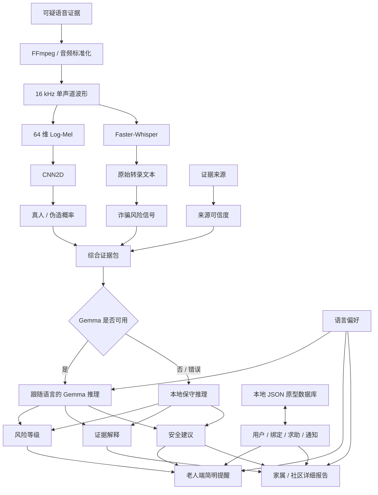

# 🛡️ AI Voice Safety Agent

<p align="right">
  <a href="./README.md">English</a> · <strong>简体中文</strong>
</p>

<p align="center">
  <strong>一个面向语音诈骗防护的多模态 AI 安全系统：语音伪造检测、风险推理与可信人工协助。</strong>
</p>

<p align="center">
  AI 语音伪造检测 × 语音转写 × 大模型风险推理 × 人本 AI
</p>

<p align="center">
  <a href="https://huggingface.co/spaces/Laura-smith/voice-spoof-detector">🌐 在线 Demo</a>
  ·
  <a href="#6-演示">🎥 演示</a>
  ·
  <a href="#10-研究发现">🔬 研究发现</a>
  ·
  <a href="#14-本地运行">⚙️ 本地运行</a>
</p>

<p align="center">
  
  
  
  
  
  
  
</p>

> [!IMPORTANT]
> AI Voice Safety Agent 是一个研究与工程原型。  
> 系统提供辅助证据和安全建议，但不能作为法律、金融、身份验证或执法场景中的最终决策系统。

---

## 目录

- [1. 项目概述](#1-项目概述)
- [2. 为什么要做这个项目](#2-为什么要做这个项目)
- [3. 从语音真假分类器到安全协同系统](#3-从语音真假分类器到安全协同系统)
- [4. 核心功能](#4-核心功能)
- [5. 用户角色与工作流程](#5-用户角色与工作流程)
- [6. 演示](#6-演示)
- [7. 系统架构](#7-系统架构)
- [8. AI 分析流程](#8-ai-分析流程)
- [9. CNN 语音伪造检测模型](#9-cnn-语音伪造检测模型)
- [10. 研究发现](#10-研究发现)
- [11. 当前部署策略](#11-当前部署策略)
- [12. 技术栈](#12-技术栈)
- [13. 项目结构](#13-项目结构)
- [14. 本地运行](#14-本地运行)
- [15. 模型训练](#15-模型训练)
- [16. 配置项](#16-配置项)
- [17. 数据隐私与负责任使用](#17-数据隐私与负责任使用)
- [18. 当前局限](#18-当前局限)
- [19. 未来计划](#19-未来计划)
- [20. 项目体现的能力](#20-项目体现的能力)
- [21. 作者与许可证](#21-作者与许可证)

---

## 1. 项目概述

**AI Voice Safety Agent** 是产品原型 **GemmaShield** 的开源工程仓库。

GemmaShield 是一个面向老年人、家属和社区工作人员的多模态 AI 语音安全系统，用于协助处理可疑语音消息和潜在的 AI 语音诈骗。

系统融合：

- 基于 CNN 的 AI 语音伪造检测；
- Faster-Whisper 语音转写；
- 诈骗风险信号提取；
- 证据来源可信度分析；
- Gemma 风险推理；
- 本地保守降级推理；
- 中文 / English 界面切换；
- 老人端页面；
- 家属/社区端页面；
- 可信协助人绑定和求助流程。

项目最初只是一个：

```text
AI 合成语音
vs.
真人语音
```

的二分类系统。

但是在真实世界实验中，我们发现：

> 实验室 benchmark 上的优秀性能，并不能自动迁移到手机录音和真实世界的语音伪造场景。

这一发现改变了项目方向。

当前系统不再把 CNN 预测结果作为最终结论，而是将模型结果视为**一项声学证据**，并结合：

```text
声学证据
+
语音转录文本
+
诈骗行为信号
+
证据来源可靠性
+
大模型推理
+
人工核实
```

项目同时连接两个方向：

### AI 科研

```text
Deepfake Speech Detection
Domain Shift
Generalization
Robustness
Unseen Attack Detection
```

### AI 应用工程

```text
Backend Development
Workflow Design
LLM Integration
Fallback Logic
Internationalization
Human-in-the-Loop Safety
Deployment
```

---

## 2. 为什么要做这个项目

传统语音伪造检测系统通常只输出：

```text
AI 伪造概率：0.82
```

但对普通用户，尤其是老年用户，这个数字无法回答：

- 为什么声音可疑？
- 对方是否要求转账？
- 是否冒充家属？
- 是否制造紧急感？
- 当前音频证据是否可靠？
- 老人是否应该继续通话？
- 是否应该联系家人？
- 当模型不确定时应该怎么办？

AI Voice Safety Agent 尝试把模型输出转化为：

```text
风险等级
+
证据解释
+
安全建议
+
可信人工协助
```

核心原则：

> 面向安全场景的 AI 系统，不应该只输出预测，还应该表达不确定性、解释证据，并允许可信的人类参与最终处理。

---

## 3. 从语音真假分类器到安全协同系统

### 最初版本

```text
音频
 ↓
Log-Mel
 ↓
CNN
 ↓
真人 / AI
```

### 当前版本

```text
可疑语音
        ↓
音频预处理
        ↓
 ┌───────────────┬────────────────┐
 ↓               ↓
CNN              Faster-Whisper
 ↓               ↓
声学证据          原始转录文本
        └──────┬──┘
               ↓
        诈骗风险信号
               +
        证据来源信息
               ↓
        Gemma 风险推理
               ↓
      风险等级 + 解释
               ↓
       老人 + 可信协助人
```

最重要的工程认识：

> 当 AI 模型在 Domain Shift 下并不可靠时，不确定性表达、证据管理、权限控制、降级逻辑和人工升级机制，本身就是安全方案的一部分。

---

## 4. 核心功能

### AI 与音频分析

- 16 kHz 单声道标准化；
- 固定长度波形；
- 64 维 Log-Mel；
- CNN2D；
- 真人 / 伪造概率；
- Faster-Whisper；
- 诈骗风险信号；
- 证据来源可信度；
- Gemma 风险推理；
- 本地保守降级推理。

### 风险等级

```text
HIGH
MEDIUM
VERIFY
LOW
```

| 等级 | 含义 |
|---|---|
| `HIGH` | 存在明显伪造证据或高危诈骗信号 |
| `MEDIUM` | 存在可疑或不确定证据 |
| `VERIFY` | 当前证据不足以支持“安全”结论 |
| `LOW` | 当前证据中未发现明显高危信号 |

`LOW` 不代表系统已经证明语音绝对安全。

### 产品流程

系统支持：

- 老人账号；
- 家属/社区协助人账号；
- Demo 手机验证；
- 六位数字绑定码；
- 协助人绑定申请；
- 老人确认；
- 最多五名可信协助人；
- 一键求助；
- 家属求助收件箱；
- 权限控制；
- 录音；
- 音频上传；
- 证据查看；
- 解绑和更换联系人；
- 模拟短信 / 微信 / Push；
- 本地原型数据持久化；
- Health 状态；
- Hugging Face 部署。

### 中英文双语体验

当前系统已经支持：

- 中文 / English 一键切换；
- 跨页面保留语言选择；
- 双语导航栏；
- 双语按钮和表单；
- 双语运行提示；
- 双语 `alert` / `confirm`；
- API 自动携带当前语言；
- Gemma 根据当前界面语言输出风险解释。

Whisper 的原始转录文本仍作为原始证据保留，不因为界面语言变化而被强制翻译。

因此系统明确区分：

```text
原始证据
   ↓
跟随用户语言的风险解释
```

### 面向老年人的设计

老人端强调：

- 大字体；
- 高对比度；
- 简单操作；
- 少展示技术指标；
- 清晰风险等级；
- 可执行安全建议；
- 中文 / English 语言选择。

---

## 5. 用户角色与工作流程

### 5.1 老人端

老人可以：

1. 完成首次设置；
2. 获得六位绑定码；
3. 确认家属或社区协助人；
4. 现场录音或上传音频；
5. 一键发起求助；
6. 接收简单风险提醒；
7. 查看历史求助；
8. 更换或删除协助人。

### 5.2 家属 / 社区端

可信协助人可以：

1. 创建或进入账号；
2. 输入老人六位绑定码；
3. 提交绑定申请；
4. 等待老人确认；
5. 接收老人求助；
6. 查看证据来源；
7. 查看已有音频；
8. 上传额外证据；
9. 执行 CNN + Whisper；
10. 执行 Gemma 推理；
11. 查看详细报告；
12. 帮助老人完成最终核实。

### 5.3 两阶段分析

#### 第一阶段

```text
CNN
+
Faster-Whisper
+
诈骗风险信号
+
证据来源可信度
```

#### 第二阶段

```text
Gemma 风险推理
```

若 Gemma 不可用：

```text
本地保守推理
```

继续提供基础分析。

---

## 系统截图

### 首页

<p align="center">
  
</p>

### 老人端

<p align="center">
  
</p>

### 家属 / 社区端

<p align="center">
  
</p>

---

## 6. 演示

### 在线系统

🌐 [打开 Hugging Face Spaces 上的 GemmaShield](https://huggingface.co/spaces/Laura-smith/voice-spoof-detector)

当前在线系统支持：

```text
中文 | English
```

直接切换。

### 完整 Demo 视频

🎥 [查看完整操作视频](assets/demo-video.mp4)

流程：

```text
老人首次设置
      ↓
家属注册
      ↓
绑定申请
      ↓
老人确认
      ↓
老人一键求助
      ↓
音频证据
      ↓
CNN + Whisper
      ↓
家属查看证据
      ↓
Gemma 推理
      ↓
安全建议
```

---

## 7. 系统架构



---

## 8. AI 分析流程

### 8.1 音频标准化

```text
采样率：16,000 Hz
声道：Mono
固定长度：64,000 samples
分析窗口：约 4 秒
```

### 8.2 Log-Mel

```text
n_fft = 1024
hop_length = 512
n_mels = 64
```

### 8.3 CNN 声学证据

```text
真人概率 = sigmoid(logit)

AI 伪造概率 = 1 - 真人概率
```

该结果只作为声学证据。

### 8.4 Faster-Whisper

Whisper 提供原始文本证据。

例如：

```text
“马上把钱转过来。”

“不要告诉其他人。”

“我是你孙子。”

“把验证码告诉我。”
```

切换到英文 UI 后，原始中文 transcript 仍然保留。

### 8.5 诈骗风险信号

```text
转账
验证码
密码
紧急施压
冒充亲属
投资收益
银行卡
```

### 8.6 证据来源可信度

| 证据来源 | 当前处理 | 主要问题 |
|---|---|---|
| 浏览器 / 麦克风录音 | 需要人工核实 | 重放、房间声学、设备噪声 |
| 老人上传音频 | 中等 | 来源处理未知 |
| 微信 / 社交软件 | 中等 | 平台压缩 |
| 语音留言 | 中等 | Codec / Channel |
| 通话录音 | 相对较高 | 电话信道仍会改变音频 |
| 家属上传证据 | 相对较高 | 取决于原始来源 |

所以：

```text
AI 伪造概率较低
```

不能自动等于：

```text
安全
```

### 8.7 跟随语言的 Gemma 推理

Gemma 接收：

```text
真人概率
AI 伪造概率
原始 Transcript
初步风险等级
诈骗类型
风险行为信号
证据来源
证据可信度
当前界面语言
```

中文模式输出：

```text
中文风险等级
中文风险解释
中文安全建议
```

English 模式输出：

```text
English Risk Level
English Evidence Explanation
English Safety Recommendation
```

原始 Whisper transcript 不被强制改写。

### 8.8 本地降级推理

以下情况触发：

```text
HF_TOKEN 未配置
Gemma 初始化失败
Gemma API 失败
Gemma 返回内容无效
```

---

## 9. CNN 语音伪造检测模型

模型位于：

```text
model.py
```

### 网络结构

```text
Input
 ↓
Conv2D
1 → 32
 ↓
BatchNorm
 ↓
ReLU
 ↓
MaxPool
 ↓
Conv2D
32 → 64
 ↓
BatchNorm
 ↓
ReLU
 ↓
MaxPool
 ↓
Conv2D
64 → 128
 ↓
ReLU
 ↓
Adaptive Average Pooling
 ↓
Flatten
 ↓
Linear
128 → 64
 ↓
ReLU
 ↓
Linear
64 → 1
```

### 输入

```text
64 维标准化 Log-Mel
```

```text
[Batch, 1, 64, Time]
```

### 训练

```text
Loss：BCEWithLogitsLoss
Optimizer：Adam
任务：Real vs. Spoof
主要指标：EER
```

---

## 10. 研究发现

### 10.1 核心研究问题

> 在受控 benchmark 中表现优秀的语音反欺骗模型，能否直接迁移到真实手机录音和实际部署环境？

### 10.2 ASVspoof Benchmark

```text
ASVspoof Benchmark EER
≈ 0.00134
```

说明训练和测试条件匹配时，模型能够取得很强的结果。

### 10.3 真实世界测试

额外收集约：

```text
100 条真实世界音频
```

包含：

- 手机录音；
- Replay；
- AI 生成语音；
- 麦克风差异；
- 环境噪声；
- 压缩；
- 传输。

结果：

```text
真实世界初始 EER
≈ 0.30
```

暴露出明显：

```text
Domain Gap
```

### 10.4 数据增强

约 100 条样本扩增到约：

```text
50,000 条
```

使用：

```text
Noise Injection
Pitch Shifting
Replay Simulation
Frequency Perturbation
Audio Distortion
Waveform Modification
```

<p align="center">
  
</p>

### 10.5 迁移学习与微调

```text
ASVspoof 预训练 CNN
       ↓
保留已学习表示
       ↓
调整部分网络层
       ↓
增强真实数据
       ↓
Fine-Tuned CNN
```

一组适配实验得到：

```text
EER
≈ 0.03
```

### 10.6 EER 对比

<p align="center">
  
</p>

| 测试条件 | EER |
|---|---:|
| ASVspoof Benchmark | **0.00134** |
| 初始真实世界测试 | **0.30** |
| 数据增强 + 微调 | **0.03** |

完整表现：

```text
Benchmark 高性能
        ↓
真实世界严重下降
        ↓
适配后显著恢复
```

### 10.7 诊断实验：冻结部分网络层

并不是所有 Transfer Learning 策略都有效。

独立诊断实验得到：

```text
原 Benchmark 模型 Accuracy：95%

Frozen-Layer Adaptation Accuracy：32%
```

<p align="center">
  
</p>

> **重要：** 95% 和 32% 是独立诊断实验中的 **Accuracy**，并不是 EER，因此不能直接与 `0.00134 / 0.30 / 0.03` 进行数值比较。

实验表明：

> 简单冻结部分网络层并不能保证模型稳定迁移到真实世界录音域。

失败实验本身成为理解 Domain Shift 和迁移学习限制的重要证据。

### 10.8 核心研究发现

> 极低的 benchmark EER 并不意味着真实世界鲁棒性。

主要影响因素：

```text
数据集不匹配
设备差异
麦克风差异
Replay Channel
房间声学
Codec Compression
背景噪声
未知生成方法
```

从：

```text
EER ≈ 0.00134
```

到：

```text
EER ≈ 0.30
```

是项目最重要的发现之一。

### 10.9 Domain Shift

```text
训练数据分布
≈
测试数据分布
```

并不代表：

```text
部署数据分布
≈
训练数据分布
```

这进一步引出：

```text
Domain Generalization
Domain Adaptation
Cross-Dataset Robustness
Unseen Attack Detection
Robust Feature Learning
```

### 10.10 如何理解 EER ≈ 0.03

`0.03` 表明适配能够显著改善实验表现。

但不能写成：

```text
生产环境错误率 = 3%
```

因为不同 EER 来自不同实验设置。

真正的结论是：

> Benchmark 成功，并不等于真实部署可靠。

### 10.11 研究如何改变产品

系统不再采用：

```text
CNN 判断
=
最终结论
```

而采用：

```text
CNN 声学证据
+
Whisper 文本
+
诈骗信号
+
证据来源
+
Gemma 推理
+
可信人工核实
```

---

## 11. 当前部署策略

当前原型采用：

```text
CNN 声学证据
+
Whisper 语义证据
+
诈骗信号
+
证据来源可信度
+
Gemma / 本地推理
+
人工核实
```

不会使用：

```text
AI 伪造概率低
=
绝对安全
```

而是：

```text
AI 伪造概率低
+
证据来源不可靠
=
需要继续核实
```

---

## 12. 技术栈

| 模块 | 技术 |
|---|---|
| 编程语言 | Python |
| 后端 | FastAPI |
| 应用服务器 | Uvicorn |
| 深度学习 | PyTorch |
| 音频处理 | Torchaudio |
| 音频读取 | SoundFile |
| 音频转换 | FFmpeg |
| 特征 | Log-Mel |
| 伪造检测 | CNN2D |
| ASR | Faster-Whisper |
| LLM | Google Gemma |
| API | Hugging Face Inference Client |
| 国际化 | 中文 / English UI + Language-aware API |
| Demo 数据库 | Local JSON |
| 通知 | 模拟 SMS / 微信 / Push |
| 部署 | Hugging Face Spaces |
| 评估 | scikit-learn ROC / EER |

---

## 13. 项目结构

```text
AI-Voice-Safety-Agent/
│
├── app.py
├── model.py
├── train.py
├── best_model.pth
├── requirements.txt
├── README.md
├── README.zh-CN.md
├── LICENSE
├── .gitignore
│
├── assets/
│   ├── homepage.png
│   ├── elder-interface.png
│   ├── helper-interface.png
│   ├── augmentation-pipeline.png
│   ├── eer-comparison.png
│   ├── transfer-learning-diagnostic.png
│   └── demo-video.mp4
│
├── docs/
│   ├── experiment-notes.md
│   └── system-design.md
│
├── experiments/
│   └── README.md
│
└── sample_audio/
    └── README.md
```

---

## 14. 本地运行

### 克隆

```bash
git clone https://github.com/lwenxuan420-lgtm/AI-Voice-Safety-Agent.git
cd AI-Voice-Safety-Agent
```

### 虚拟环境

#### Windows

```powershell
python -m venv .venv
.venv\Scripts\Activate.ps1
```

#### macOS / Linux

```bash
python3 -m venv .venv
source .venv/bin/activate
```

### 安装依赖

```bash
pip install --upgrade pip
pip install -r requirements.txt
```

建议：

```text
numpy==1.26.4
fastapi
uvicorn[standard]
python-multipart
torch
torchaudio
soundfile
faster-whisper
huggingface_hub>=0.31.0
pandas
scikit-learn
tqdm
```

> 当前固定使用 `numpy==1.26.4`，以保持 Hugging Face Spaces 部署环境与 PyTorch 的兼容性。

### FFmpeg

```bash
ffmpeg -version
```

### 模型

将：

```text
best_model.pth
```

放在仓库根目录。

### Gemma

Windows：

```powershell
$env:HF_TOKEN="your_hugging_face_token"
$env:GEMMA_MODEL_ID="google/gemma-4-26B-A4B-it"
$env:GEMMA_PROVIDER="deepinfra"
```

macOS / Linux：

```bash
export HF_TOKEN="your_hugging_face_token"
export GEMMA_MODEL_ID="google/gemma-4-26B-A4B-it"
export GEMMA_PROVIDER="deepinfra"
```

不配置 `HF_TOKEN` 时，系统使用本地保守推理。

### 启动

```bash
python app.py
```

打开：

```text
http://localhost:7860
```

---

## 15. 模型训练

修改 `train.py`：

```python
ASV_ROOTS = [
    "path/to/asvspoof/data"
]

ASV_CSV = "path/to/train.csv"
```

训练流程：

```text
音频
 ↓
读取 Waveform
 ↓
Stereo → Mono
 ↓
16 kHz
 ↓
波形标准化
 ↓
Pad / Truncate
 ↓
Log-Mel
 ↓
特征标准化
 ↓
CNN
 ↓
BCEWithLogitsLoss
 ↓
验证 EER
 ↓
保存最佳模型
```

运行：

```bash
python train.py
```

未来可复现版本应继续记录：

- ASVspoof 子集；
- Protocol；
- Random Seed；
- 数据划分；
- 增强参数；
- Transfer Learning 配置；
- Freeze 策略；
- Checkpoint 选择；
- Cross-Dataset 测试；
- 多次实验方差。

---

## 16. 配置项

| 变量 | 是否必须 | 作用 |
|---|---:|---|
| `HF_TOKEN` | 否 | Hugging Face / Gemma |
| `GEMMA_MODEL_ID` | 否 | Gemma Model |
| `GEMMA_PROVIDER` | 否 | 推理 Provider |
| `TORCH_NUM_THREADS` | 否 | CPU Threads |
| `PORT` | 否 | 应用端口 |

默认：

```text
7860
```

可选：

```text
SMS_API_KEY
WECHAT_APP_ID
WECHAT_APP_SECRET
PUSH_API_KEY
```

---

## 17. 数据隐私与负责任使用

项目使用 ASVspoof 研究数据和额外真实世界样本。

公开音频只应包括：

- 合成音频；
- 开放许可音频；
- 明确授权的录音。

当前原型可能使用：

```text
requests_db.json
uploads/
```

生产环境需要：

```text
安全认证
传输加密
存储加密
权限控制
Secret Management
知情同意
数据保留政策
用户删除
Audit Logging
Abuse Monitoring
安全对象存储
生产数据库
```

### 适用范围

- AI Safety；
- Deepfake Speech Detection；
- Human-Centered AI；
- 教育展示；
- AI 应用工程；
- 诈骗风险辅助；
- 可信协助流程。

### 不适用范围

不能用于：

- 监控；
- 未授权身份追踪；
- 未经许可说话人识别；
- 秘密录制；
- 自动犯罪指控；
- 自动法律判断；
- 自动金融判断；
- 替代银行或警方；
- 把 AI 分数当作真实性证明。

---

## 18. 当前局限

### 模型

- 未见攻击可能降低性能；
- 麦克风重录会改变伪造特征；
- Replay Channel 造成 Domain Shift；
- 压缩影响声学特征；
- Benchmark 不能直接代表真实部署。

### Whisper

- 噪声影响转录；
- 口音和音质可能产生影响；
- 错误转录可能影响后续推理。

### Gemma

- 依赖输入证据；
- 错误 transcript 会影响推理；
- 不能作为法律或金融判断。

### 工程

- JSON 只适合 Demo；
- OTP 为演示流程；
- 消息通知为模拟；
- 上传音频当前存于本地；
- 尚未使用生产数据库；
- CNN 分析固定音频窗口；
- 目前不是完整实时通话监控服务。

### 产品

- 当前已经支持中文和 English；
- 尚未支持更多语言；
- 仍需要更大规模老人用户测试；
- 需要正式 Accessibility 测试；
- 生产级紧急升级机制仍需完善。

---

## 19. 未来计划

### 科研

```text
Cross-Dataset Evaluation
Domain Adaptation
Domain Generalization
Unseen Attack Detection
Self-Supervised Speech Representations
Contrastive Learning
One-Class Learning
Uncertainty Estimation
Calibration
Replay Simulation
Robust Feature Learning
```

### 工程

```text
PostgreSQL / Supabase
安全对象存储
真实 SMS / 微信 / Push
后台任务
Monitoring
Logging
自动化测试
Docker
CI/CD
模型版本管理
Streaming Audio
Edge Deployment
```

### 产品

```text
在中文 / English 基础上扩展更多语言
老人用户测试
家属用户测试
社区人员测试
更清晰的不确定性展示
紧急升级流程
机构 Dashboard
Permission-Controlled Function Calling
```

---

## 20. 项目体现的能力

这个项目展示了：

```text
发现真实问题
      ↓
数据准备
      ↓
模型开发
      ↓
Benchmark 测试
      ↓
发现真实世界失败
      ↓
Domain Gap 分析
      ↓
数据增强
      ↓
迁移学习
      ↓
失败实验诊断
      ↓
重新设计安全产品
      ↓
后端开发
      ↓
大模型集成
      ↓
中英文产品国际化
      ↓
Human-in-the-Loop
      ↓
部署
```

涉及：

```text
Machine Learning
Audio Processing
Deepfake Detection
Model Evaluation
Backend Engineering
API Integration
LLM Reasoning
Internationalization
Workflow Design
AI Safety
Responsible AI
Human-Centered Product Design
```

项目最重要的成果不是单一指标，而是：

> 发现模型在哪里失效，理解为什么失效，并重新设计整个系统，使不确定性能够被清晰表达，同时保留可信的人类参与。

---

## 21. 作者与许可证

维护者：

**lwenxuan420-lgtm**

GitHub：

```text
https://github.com/lwenxuan420-lgtm
```

项目方向：

```text
AI Safety
Voice Security
Deepfake Speech Detection
Explainable AI
Multimodal AI Systems
Human-Centered AI
AI Application Engineering
```

项目使用：

**MIT License**

---

<p align="center">
  <strong>GemmaShield</strong>
</p>

<p align="center">
  从实验室语音检测走向真实世界、人本化的 AI 安全系统。
</p>

<p align="center">
  <a href="./README.md">🇬🇧 Read in English</a>
</p>
