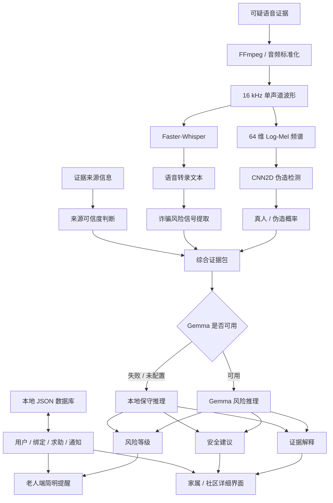

# 🛡️ AI Voice Safety Agent

<p align="right">
  <a href="./README.md">English</a> · <strong>简体中文</strong>
</p>

<p align="center">
  <strong>一个面向语音诈骗防护的多模态 AI 安全系统：语音伪造检测、风险推理与可信人工协助。</strong>
</p>

<p align="center">
  AI 语音伪造检测 × 语音转写 × 大模型风险推理 × 人本 AI
</p>

<p align="center">
  <a href="https://huggingface.co/spaces/Laura-smith/voice-spoof-detector">🌐 在线 Demo</a>
  ·
  <a href="#6-演示">🎥 演示</a>
  ·
  <a href="#10-研究发现">🔬 研究发现</a>
  ·
  <a href="#14-本地运行">⚙️ 本地运行</a>
</p>

<p align="center">
  
  
  
  
  
  
</p>

> [!IMPORTANT]
> AI Voice Safety Agent 是一个研究与工程原型。
> 系统提供辅助证据和安全建议，但不能作为法律、金融、身份验证或执法场景中的最终决策系统。

---

## 目录

- [1. 项目概述](#1-项目概述)
- [2. 为什么要做这个项目](#2-为什么要做这个项目)
- [3. 从语音真假分类器到安全协同系统](#3-从语音真假分类器到安全协同系统)
- [4. 核心功能](#4-核心功能)
- [5. 用户角色与工作流程](#5-用户角色与工作流程)
- [6. 演示](#6-演示)
- [7. 系统架构](#7-系统架构)
- [8. AI 分析流程](#8-ai-分析流程)
- [9. CNN 语音伪造检测模型](#9-cnn-语音伪造检测模型)
- [10. 研究发现](#10-研究发现)
- [11. 当前部署策略](#11-当前部署策略)
- [12. 技术栈](#12-技术栈)
- [13. 项目结构](#13-项目结构)
- [14. 本地运行](#14-本地运行)
- [15. 模型训练](#15-模型训练)
- [16. 配置项](#16-配置项)
- [17. 数据隐私与负责任使用](#17-数据隐私与负责任使用)
- [18. 当前局限](#18-当前局限)
- [19. 未来计划](#19-未来计划)
- [20. 项目体现的能力](#20-项目体现的能力)
- [21. 作者与许可证](#21-作者与许可证)

---

## 1. 项目概述

**AI Voice Safety Agent** 是产品原型 **GemmaShield** 的开源工程仓库。

GemmaShield 是一个面向老年人、家属和社区工作人员的多模态 AI 语音安全系统，用于协助处理可疑语音消息和潜在的 AI 语音诈骗。

系统融合：

- 基于 CNN 的 AI 语音伪造检测；
- Faster-Whisper 语音转写；
- 诈骗风险信号提取；
- 证据来源可信度分析；
- Gemma 风险推理；
- 本地保守降级推理；
- 老人端页面；
- 家属/社区端页面；
- 可信协助人绑定和求助流程。

项目最初只是一个：

```text
AI 合成语音
vs.
真人语音
```

的二分类系统。

但是在真实世界实验中，我们发现了一个非常重要的问题：

> 实验室 benchmark 上的优秀性能，并不能自动迁移到手机录音和真实世界的语音伪造场景。

这一发现改变了项目方向。

当前系统不再把 CNN 预测结果作为最终结论，而是将模型结果视为**一项声学证据**，并结合：

```text
声学证据
+
语音转录文本
+
诈骗行为信号
+
证据来源可靠性
+
大模型推理
+
人工核实
```

因此，这个项目同时探索：

### AI 科研

```text
Deepfake Speech Detection
Domain Shift
Generalization
Robustness
Unseen Attack Detection
```

### AI 应用工程

```text
Backend Development
Workflow Design
LLM Integration
Fallback Logic
Human-in-the-Loop Safety
Deployment
```

---

## 2. 为什么要做这个项目

传统语音伪造检测系统通常只会输出一个数字：

```text
AI 伪造概率：0.82
```

但对于普通用户，尤其是老年用户，这个数字并不能回答真正重要的问题：

- 为什么这段声音可疑？
- 对方是否要求转账？
- 对方是否在冒充家属？
- 对方是否在制造紧急感？
- 当前音频本身是否可靠？
- 老人应该继续和对方沟通吗？
- 是否应该联系家人？
- 当模型自己也不确定时应该怎么办？

AI Voice Safety Agent 尝试解决这一问题。

系统把原始 AI 输出转化为：

```text
风险等级
+
证据解释
+
安全建议
+
可信人工协助
```

项目遵循一个核心原则：

> 面向安全场景的 AI 系统，不应该只输出预测，还应该表达不确定性、解释证据，并允许可信的人类参与最终处理。

---

## 3. 从语音真假分类器到安全协同系统

### 最初版本

```text
音频
 ↓
Log-Mel 频谱
 ↓
CNN
 ↓
真人 / AI
```

真实世界实验随后暴露出了明显局限。

### 当前版本

```text
可疑语音
        ↓
音频预处理
        ↓
 ┌───────────────┬────────────────┐
 ↓               ↓
CNN              Faster-Whisper
 ↓               ↓
声学证据          转录文本
        └──────┬──┘
               ↓
        诈骗风险信号
               +
        证据来源信息
               ↓
        Gemma 风险推理
               ↓
      风险等级 + 解释
               ↓
       老人 + 可信协助人
```

项目最重要的工程认识是：

> 当 AI 模型在 Domain Shift 下并不可靠时，不确定性表达、证据管理、权限控制、降级逻辑和人工升级机制，本身就是安全方案的一部分。

---

## 4. 核心功能

### AI 与音频分析

- 16 kHz 单声道音频标准化；
- 固定长度波形处理；
- 64 维 Log-Mel 频谱；
- 自定义 CNN2D；
- 真人 / 伪造概率估计；
- Faster-Whisper 语音转写；
- 诈骗风险信号提取；
- 证据来源可信度判断；
- Gemma 结构化风险推理；
- 本地保守降级推理。

### 风险等级

```text
HIGH
MEDIUM
VERIFY
LOW
```

| 等级 | 含义 |
|---|---|
| `HIGH` | 存在明显伪造证据或高危诈骗信号 |
| `MEDIUM` | 存在可疑或不确定证据 |
| `VERIFY` | 当前证据不足以支持“安全”结论 |
| `LOW` | 当前证据中未发现明显高危信号 |

`LOW` 不代表系统已经证明语音绝对安全。

### 产品流程

系统目前支持：

- 老人账号；
- 家属/社区协助人账号；
- Demo 手机验证；
- 六位数字可信协助人绑定码；
- 协助人绑定申请；
- 老人确认；
- 最多五名可信协助人；
- 一键发起求助；
- 家属求助收件箱；
- 求助权限管理；
- 老人端录音；
- 音频上传；
- 证据查看；
- 解绑与更换可信联系人；
- 模拟短信 / 微信 / Push；
- 本地 Demo 数据持久化；
- Health 状态；
- Hugging Face Spaces 部署。

### 面向老年人的设计

老人端强调：

- 大字体；
- 高对比度；
- 简单操作；
- 尽量少展示技术指标；
- 清晰风险等级；
- 可执行安全建议。

家属/社区端展示更多技术证据。

---

## 5. 用户角色与工作流程

### 5.1 老人端

老人可以：

1. 完成首次设置；
2. 获得六位绑定码；
3. 确认家属或社区协助人；
4. 现场录音或上传可疑音频；
5. 一键发起求助；
6. 接收简单风险提醒；
7. 查看历史求助；
8. 更换或删除可信协助人。

### 5.2 家属 / 社区端

可信协助人可以：

1. 创建或进入协助人账号；
2. 输入老人端六位数字；
3. 提交绑定申请；
4. 等待老人确认；
5. 接收老人求助；
6. 查看证据来源；
7. 查看已有音频；
8. 上传额外证据；
9. 执行 CNN + Whisper 第一阶段分析；
10. 执行 Gemma 第二阶段推理；
11. 查看完整风险报告；
12. 帮助老人进行最终核实。

### 5.3 两阶段 AI 分析

#### 第一阶段

```text
CNN
+
Faster-Whisper
+
诈骗风险信号
+
证据来源可信度
```

#### 第二阶段

```text
Gemma 风险推理
```

如果 Gemma 不可用：

```text
本地保守推理
```

会继续提供基础安全分析。

---

## 系统截图

### 首页

<p align="center">
  
</p>

### 老人端

<p align="center">
  
</p>

### 家属 / 社区端

<p align="center">
  
</p>

---

## 6. 演示

### 在线系统

🌐 [打开 Hugging Face Spaces 上的 GemmaShield](https://huggingface.co/spaces/Laura-smith/voice-spoof-detector)

### 完整 Demo 视频

🎥 [查看完整操作视频](assets/demo-video.mp4)

完整 Demo 流程：

```text
老人首次设置
      ↓
家属注册
      ↓
绑定申请
      ↓
老人确认
      ↓
老人一键求助
      ↓
音频证据
      ↓
CNN + Whisper
      ↓
家属查看证据
      ↓
Gemma 推理
      ↓
安全建议
```

> 如果 Hugging Face Space 因地区或网络问题暂时无法访问，可以查看录制视频或在本地运行项目。

---

## 7. 系统架构



---

## 8. AI 分析流程

### 8.1 音频标准化

```text
采样率：16,000 Hz
声道：单声道
固定长度：64,000 个采样点
分析窗口：约 4 秒
```

### 8.2 Log-Mel 频谱

```text
n_fft = 1024
hop_length = 512
n_mels = 64
```

```text
Waveform
   ↓
Mel Spectrogram
   ↓
Log Transform
   ↓
Feature Normalization
```

### 8.3 CNN 声学证据

```text
真人概率 = sigmoid(logit)

AI 伪造概率 = 1 - 真人概率
```

该概率只作为声学证据，而不是最终安全结论。

### 8.4 Faster-Whisper

Whisper 提供文本语义证据。

例如：

```text
“马上把钱转过来。”

“不要告诉其他人。”

“我是你孙子。”

“把验证码告诉我。”
```

即使声学证据并不明确，这些内容仍可能构成重要诈骗信号。

### 8.5 诈骗风险信号

当前系统检测：

```text
转账
验证码
密码
紧急施压
冒充亲属
投资收益
银行卡
```

### 8.6 证据来源可信度

| 证据来源 | 当前可信度处理 | 主要问题 |
|---|---|---|
| 浏览器 / 麦克风现场录音 | 需要人工核实 | 重放、房间声学、设备噪声 |
| 老人上传音频 | 中等 | 来源处理未知 |
| 微信 / 社交软件语音 | 中等 | 平台压缩 |
| 语音留言 | 中等 | 编码与信道 |
| 保存的通话录音 | 相对较高 | 电话信道仍会改变音频 |
| 家属上传证据 | 相对较高 | 仍取决于原始来源 |

所以：

```text
AI 伪造概率较低
```

不能直接等于：

```text
安全
```

### 8.7 Gemma 风险推理

Gemma 接收：

```text
真人概率
AI 伪造概率
语音文本
初步风险等级
诈骗类型
风险行为信号
证据来源
证据可信度
```

输出：

```text
风险等级
原因
声音证据解释
文本证据解释
给老人的建议
给家属的建议
一句话提醒
```

Gemma 的作用是：

```text
综合推理
+
风险解释
+
安全沟通
```

不是替 CNN 修改预测结果。

### 8.8 本地降级推理

以下情况启用：

```text
HF_TOKEN 未配置
Gemma 初始化失败
Gemma API 失败
Gemma 输出无效
```

---

## 9. CNN 语音伪造检测模型

模型位于：

```text
model.py
```

### 模型结构

```text
Input
 ↓
Conv2D
1 → 32
 ↓
BatchNorm
 ↓
ReLU
 ↓
MaxPool
 ↓
Conv2D
32 → 64
 ↓
BatchNorm
 ↓
ReLU
 ↓
MaxPool
 ↓
Conv2D
64 → 128
 ↓
ReLU
 ↓
Adaptive Average Pooling
 ↓
Flatten
 ↓
Linear
128 → 64
 ↓
ReLU
 ↓
Linear
64 → 1
```

### 输入

```text
标准化的 64 维 Log-Mel 频谱
```

```text
[Batch, 1, 64, Time]
```

### 训练

```text
BCEWithLogitsLoss
Adam Optimizer
```

任务：

```text
真人
vs.
AI / Spoof
```

主要研究指标：

```text
Equal Error Rate
EER
```

---

## 10. 研究发现

### 10.1 核心研究问题

> 在受控反欺骗 benchmark 中表现优秀的模型，能否直接迁移到真实手机录音和实际部署环境？

---

### 10.2 ASVspoof Benchmark

模型最初主要使用 ASVspoof 数据训练和评估。

结果：

```text
ASVspoof Benchmark EER
≈ 0.00134
```

说明在训练环境和测试环境高度匹配时，模型能够获得非常好的结果。

---

### 10.3 真实世界测试

项目额外收集并测试约：

```text
100 条真实世界音频
```

包含：

- 手机录音；
- 重放音频；
- AI 生成语音；
- 不同麦克风；
- 环境噪声；
- 压缩音频；
- 传输后的语音。

结果：

```text
真实世界初始 EER
≈ 0.30
```

这一结果暴露出明显的：

```text
Domain Gap
```

---

### 10.4 数据增强

由于最初真实世界数据只有约：

```text
100 条
```

项目建立数据增强流程，扩增到约：

```text
50,000 条
```

使用：

```text
Noise Injection
Pitch Shifting
Replay Simulation
Frequency Perturbation
Audio Distortion
Waveform Modification
```

<p align="center">
  
</p>

<p align="center">
  <em>真实世界数据增强与模型适配流程。</em>
</p>

---

### 10.5 迁移学习与微调

项目继续利用 ASVspoof 模型已经学习到的表示：

```text
ASVspoof 预训练 CNN
       ↓
保留已学习表示
       ↓
调整部分网络层
       ↓
增强真实世界数据
       ↓
Fine-Tuning
```

适配后的一组实验结果：

```text
EER
≈ 0.03
```

---

### 10.6 EER 对比

<p align="center">
  
</p>

| 测试环境 | EER |
|---|---:|
| ASVspoof Benchmark | **0.00134** |
| 初始真实世界测试 | **0.30** |
| 数据增强 + 微调 | **0.03** |

该结果完整体现了：

```text
Benchmark 高性能
        ↓
真实世界严重下降
        ↓
数据适配后部分恢复
```

---

### 10.7 诊断实验：冻结部分网络层

并不是所有迁移学习策略都有效。

项目单独进行了冻结部分网络层的诊断实验。

该实验中的 Accuracy 为：

```text
原 benchmark 训练模型：95%

Frozen-layer adaptation：32%
```

<p align="center">
  
</p>

> **重要说明：** 这里的 95% 和 32% 是一次独立诊断实验中的 Accuracy，和上面的 EER 属于不同指标，不能直接进行数值比较。

该诊断实验表明：

> 简单冻结部分网络层并不能保证模型能够迁移到真实世界录音域，这促使项目继续调整后续的适配策略。

这一失败实验没有被隐藏，而是成为分析 Domain Shift 与迁移学习限制的重要证据。

---

### 10.8 最重要的研究发现

> 极低的 benchmark EER 并不意味着模型具有真实世界鲁棒性。

模型容易受到：

```text
数据集不匹配
设备差异
麦克风差异
重放信道
房间环境
编码压缩
背景噪声
未知语音生成方法
```

影响。

从：

```text
EER ≈ 0.00134
```

到：

```text
EER ≈ 0.30
```

的巨大变化，是整个项目最重要的研究发现之一。

---

### 10.9 Domain Shift

当：

```text
训练数据分布
≈
测试数据分布
```

模型可能表现很好。

真实部署则可能出现：

```text
部署数据分布
≠
训练数据分布
```

因此引出：

```text
Domain Generalization
Domain Adaptation
Cross-Dataset Robustness
Unseen Attack Detection
Robust Feature Learning
```

等研究问题。

---

### 10.10 如何理解 EER = 0.03

```text
EER ≈ 0.03
```

说明数据增强和适配能够显著改善实验性能。

但不能写成：

```text
真实生产环境错误率只有 3%
```

三组 EER 来自不同实验条件。

真正重要的结论是：

> Benchmark 成功，并不等于真实世界部署可靠。

---

### 10.11 研究如何改变产品

系统不再采用：

```text
CNN 判断
=
最终结论
```

而是：

```text
CNN 声学证据
+
Whisper 文本
+
诈骗信号
+
证据来源
+
Gemma 推理
+
可信人工核实
```

从而把：

```text
模型研究
```

真正连接到了：

```text
AI 产品安全设计
```

---

## 11. 当前部署策略

当前公开 Demo 使用保守策略。

研究实验和实际部署 checkpoint 应该分开理解。

实验中的迁移学习和微调主要用于研究：

```text
Robustness
Domain Shift
Adaptation
```

系统部署则强调：

```text
稳定声学证据
+
语义证据
+
证据来源
+
风险推理
+
人工核实
```

不采用：

```text
AI 伪造概率低
=
绝对安全
```

而是：

```text
AI 伪造概率低
+
证据来源不可靠
=
需要进一步核实
```

系统目标不是让 AI 显得“非常确定”。

而是：

> 避免把不确定预测包装成绝对真相。

---

## 12. 技术栈

| 模块 | 技术 |
|---|---|
| 编程语言 | Python |
| 后端 | FastAPI |
| 应用服务器 | Uvicorn |
| 深度学习 | PyTorch |
| 音频处理 | Torchaudio |
| 音频读取 | SoundFile |
| 音频转换 | FFmpeg |
| 声学特征 | Log-Mel Spectrogram |
| 伪造检测 | 自定义 CNN2D |
| 语音识别 | Faster-Whisper |
| 大模型推理 | Google Gemma |
| API | Hugging Face Inference Client |
| Demo 数据库 | 本地 JSON |
| 消息通知 | 模拟短信 / 微信 / Push |
| 部署 | Hugging Face Spaces |
| 模型评估 | scikit-learn ROC / EER |

---

## 13. 项目结构

```text
AI-Voice-Safety-Agent/
│
├── app.py
├── model.py
├── train.py
├── best_model.pth
├── requirements.txt
├── README.md
├── README.zh-CN.md
├── LICENSE
├── .gitignore
│
├── assets/
│   ├── homepage.png
│   ├── elder-interface.png
│   ├── helper-interface.png
│   ├── augmentation-pipeline.png
│   ├── eer-comparison.png
│   ├── transfer-learning-diagnostic.png
│   └── demo-video.mp4
│
├── docs/
│   ├── experiment-notes.md
│   └── system-design.md
│
├── experiments/
│   └── README.md
│
└── sample_audio/
    └── README.md
```

---

## 14. 本地运行

### 克隆项目

```bash
git clone https://github.com/lwenxuan420-lgtm/AI-Voice-Safety-Agent.git
cd AI-Voice-Safety-Agent
```

### 创建虚拟环境

#### Windows

```powershell
python -m venv .venv
.venv\Scripts\Activate.ps1
```

#### macOS / Linux

```bash
python3 -m venv .venv
source .venv/bin/activate
```

### 安装依赖

```bash
pip install --upgrade pip
pip install -r requirements.txt
```

建议依赖：

```text
fastapi
uvicorn[standard]
python-multipart
torch
torchaudio
soundfile
faster-whisper
huggingface-hub
numpy
pandas
scikit-learn
tqdm
```

### FFmpeg

```bash
ffmpeg -version
```

### 模型

将：

```text
best_model.pth
```

放在项目根目录。

### 配置 Gemma

#### Windows

```powershell
$env:HF_TOKEN="your_hugging_face_token"
$env:GEMMA_MODEL_ID="google/gemma-4-26B-A4B-it"
$env:GEMMA_PROVIDER="deepinfra"
```

#### macOS / Linux

```bash
export HF_TOKEN="your_hugging_face_token"
export GEMMA_MODEL_ID="google/gemma-4-26B-A4B-it"
export GEMMA_PROVIDER="deepinfra"
```

不配置 `HF_TOKEN` 时系统仍可运行，并使用本地保守推理。

### 启动

```bash
python app.py
```

打开：

```text
http://localhost:7860
```

主要地址：

```text
/          首页
/elder     老人端
/helper    家属 / 社区端
/health    系统状态
```

---

## 15. 模型训练

### 数据路径

修改：

```text
train.py
```

中的本地路径。

例如：

```python
ASV_ROOTS = [
    "path/to/asvspoof/data"
]

ASV_CSV = "path/to/train.csv"
```

不要上传：

- 私人绝对路径；
- 未经许可的真实录音；
- 受限制数据。

### 训练流程

```text
音频
 ↓
读取 Waveform
 ↓
双声道 → 单声道
 ↓
16 kHz 重采样
 ↓
波形标准化
 ↓
补齐 / 截断
 ↓
Log-Mel
 ↓
特征标准化
 ↓
CNN
 ↓
BCEWithLogitsLoss
 ↓
验证 EER
 ↓
保存最佳模型
```

运行：

```bash
python train.py
```

### 后续可复现性完善

未来应记录：

- ASVspoof 具体子集；
- protocol；
- 随机种子；
- train / validation / test；
- 数据增强参数；
- transfer learning 设置；
- 网络冻结策略；
- checkpoint 选择规则；
- 不同信道结果；
- cross-dataset 测试；
- 多次实验方差。

---

## 16. 配置项

| 变量 | 是否必须 | 作用 |
|---|---:|---|
| `HF_TOKEN` | 否 | Hugging Face / Gemma |
| `GEMMA_MODEL_ID` | 否 | Gemma Model ID |
| `GEMMA_PROVIDER` | 否 | 推理 Provider |
| `TORCH_NUM_THREADS` | 否 | CPU 线程 |
| `PORT` | 否 | 应用端口 |

默认：

```text
7860
```

可选通知变量：

```text
SMS_API_KEY
WECHAT_APP_ID
WECHAT_APP_SECRET
PUSH_API_KEY
```

当前公开 Demo 默认使用模拟通知。

---

## 17. 数据隐私与负责任使用

### 科研数据

项目使用 ASVspoof 研究数据，同时使用额外收集的真实世界样本完成鲁棒性实验。

公开音频只应包含：

- 合成音频；
- 明确开放许可音频；
- 明确获得参与者授权的录音。

### 当前原型存储

```text
requests_db.json
uploads/
```

用于保存 Demo：

- 用户；
- Session；
- 绑定申请；
- 求助；
- 通知；
- 音频证据。

只适合研究原型。

### 真实上线需要

```text
安全身份认证
传输加密
存储加密
权限控制
密钥管理
用户知情同意
数据保留政策
用户删除能力
审计日志
滥用监控
安全对象存储
生产数据库
```

### 项目适用范围

- AI Safety；
- Deepfake Speech Detection；
- Human-Centered AI；
- 教育展示；
- AI 应用工程；
- 诈骗风险辅助判断；
- 可信协助流程原型。

### 不适用范围

不能用于：

- 监控；
- 未授权身份追踪；
- 未经许可的说话人识别；
- 秘密录制；
- 自动指控犯罪；
- 自动法律判断；
- 自动金融判断；
- 替代警方或银行；
- 把 AI 分数当作真实性证明。

---

## 18. 当前局限

### 模型

- 未见伪造方式可能导致性能下降；
- 麦克风重录可能改变伪造特征；
- Replay Channel 可能产生 Domain Shift；
- 压缩可能改变声学特征；
- benchmark 结果不能直接代表部署性能。

### Whisper

- 噪声可能降低转录准确率；
- 口音和音质会产生影响；
- 错误文本可能影响后续推理。

### Gemma

- 依赖已有输入证据；
- 错误转录可能影响推理；
- 不能作为法律或金融判断。

### 工程

- JSON 数据库只适合 Demo；
- OTP 为演示流程；
- 消息通知目前为模拟；
- 上传音频当前保存在本地；
- 尚未使用生产数据库；
- CNN 分析固定窗口；
- 目前不是完整实时电话监控服务。

### 产品

- 当前 UI 以中文为主；
- 需要更多老年用户测试；
- 需要正式 Accessibility 测试；
- 紧急升级机制仍需进一步设计。

---

## 19. 未来计划

### 科研

```text
Cross-Dataset Evaluation
Domain Adaptation
Domain Generalization
Unseen Attack Detection
Self-Supervised Speech Representations
Contrastive Learning
One-Class Learning
Uncertainty Estimation
Calibration
Replay Simulation
Robust Feature Learning
```

### 工程

```text
PostgreSQL / Supabase
安全对象存储
真实短信 / 微信 / Push
后台任务队列
Monitoring
Logging
自动化测试
Docker
CI/CD
模型版本管理
Streaming Audio
Edge Deployment
```

### 产品

```text
多语言界面
老人用户测试
家属用户测试
社区人员测试
不确定性展示
紧急升级流程
机构 Dashboard
Permission-Controlled Function Calling
```

---

## 20. 项目体现的能力

这个项目不仅记录模型训练。

它展示了：

```text
发现真实问题
      ↓
数据准备
      ↓
模型开发
      ↓
Benchmark 测试
      ↓
发现真实世界失败
      ↓
Domain Gap 分析
      ↓
数据增强
      ↓
迁移学习
      ↓
失败实验诊断
      ↓
重新设计安全产品
      ↓
后端开发
      ↓
大模型集成
      ↓
Human-in-the-Loop Workflow
      ↓
部署
```

涉及：

```text
Machine Learning
Audio Processing
Deepfake Detection
Model Evaluation
Backend Engineering
API Integration
LLM Reasoning
Workflow Design
AI Safety
Responsible AI
Human-Centered Product Design
```

项目最重要的成果并不是单一指标。

而是：

> 发现模型在哪里失效，理解为什么失效，并重新设计系统，使不确定性得到清晰表达，同时保留可信的人类参与。

---

## 21. 作者与许可证

维护者：

**lwenxuan420-lgtm**

GitHub：

```text
https://github.com/lwenxuan420-lgtm
```

项目方向：

```text
AI Safety
Voice Security
Deepfake Speech Detection
Explainable AI
Multimodal AI Systems
Human-Centered AI
AI Application Engineering
```

项目使用：

**MIT License**

---

<p align="center">
  <strong>GemmaShield</strong>
</p>

<p align="center">
  从实验室语音检测走向真实世界、人本化的 AI 安全系统。
</p>

<p align="center">
  <a href="./README.md">🇬🇧 Read in English</a>
</p>
